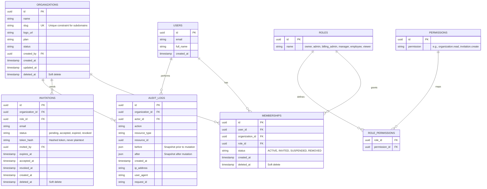
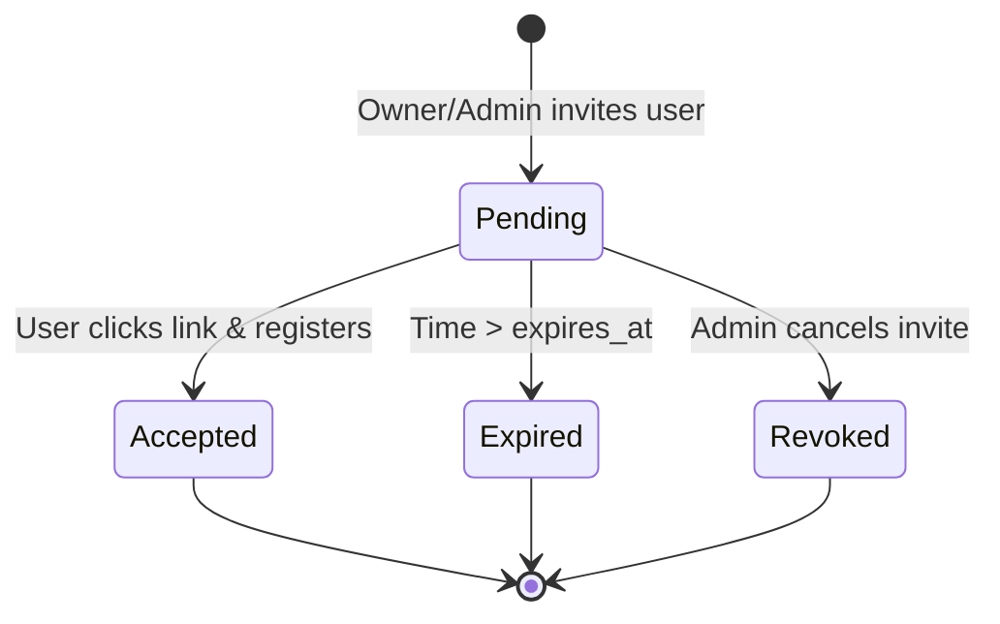
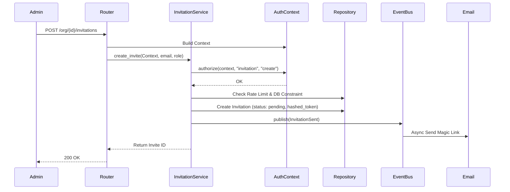
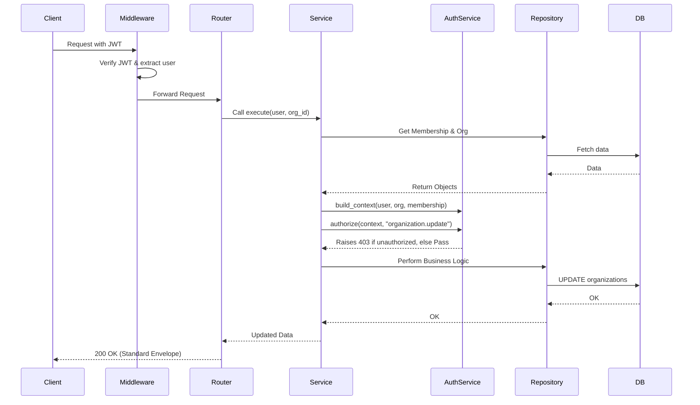

# Sprint 2 Design: Organization & Access Platform

## 1. Goal
End of Sprint 2: A company can Signup -> Create Organization -> Invite Employees -> Accept Invite -> Assign Roles -> Enforce Permissions -> Audit Logs Generated.

## 2. Organization Domain Model

Organizations are the root of tenancy in Calyx. Every resource (except global user accounts) belongs to an Organization.
Memberships map Users to Organizations and hold the RBAC Roles. All core mutations publish Domain Events (e.g., `OrganizationCreated`) via an in-process event bus to handle side-effects cleanly.

## 3. Database Design (Updated ER Diagram)


**Database Constraints:**
- `organization.slug`: UNIQUE
- `membership (user_id, organization_id)`: UNIQUE
- `invitation (email, organization_id)`: UNIQUE WHERE `status='pending'`

## 4. Invitation State Machine



## 5. RBAC Permission Matrix

System Roles: Owner, Admin, Billing Admin, Manager, Employee, Viewer
Granular String-Based Permissions

| Permission | Owner | Admin | Billing Admin | Manager | Employee | Viewer |
|------------|-------|-------|---------------|---------|----------|--------|
| `organization.read` | ✅ | ✅ | ✅ | ✅ | ✅ | ✅ |
| `organization.update` | ✅ | ✅ | ❌ | ❌ | ❌ | ❌ |
| `organization.delete` | ✅ | ❌ | ❌ | ❌ | ❌ | ❌ |
| `organization.billing` | ✅ | ❌ | ✅ | ❌ | ❌ | ❌ |
| `organization.settings` | ✅ | ✅ | ❌ | ❌ | ❌ | ❌ |
| `invitation.create` | ✅ | ✅ | ❌ | ✅ | ❌ | ❌ |
| `invitation.read` | ✅ | ✅ | ❌ | ✅ | ❌ | ❌ |
| `invitation.revoke` | ✅ | ✅ | ❌ | ✅ | ❌ | ❌ |
| `membership.read` | ✅ | ✅ | ❌ | ✅ | ✅ | ✅ |
| `membership.update` | ✅ | ✅ | ❌ | ❌ | ❌ | ❌ |
| `membership.remove` | ✅ | ✅ | ❌ | ❌ | ❌ | ❌ |
| `audit.read` | ✅ | ✅ | ❌ | ❌ | ❌ | ❌ |
| `memory.read` (Future)| ✅ | ✅ | ❌ | ✅ | ✅ | ✅ |
| `memory.create` (Future)| ✅ | ✅ | ❌ | ✅ | ✅ | ❌ |
| `memory.delete` (Future)| ✅ | ✅ | ❌ | ✅ | ❌ | ❌ |

## 6. Authorization Service Design

The `AuthorizationService` resolves RBAC dynamically without hardcoding role enums in business logic. It relies on an `AuthorizationContext`.

**Context Model:**
```python
class AuthorizationContext:
    user: User
    membership: Membership
    organization: Organization
    permissions: List[str]
```

**Core Function Signature:**
`AuthorizationService.authorize(context: AuthorizationContext, resource: str, action: str) -> None`
*Note: Translates `resource` and `action` to `{resource}.{action}` string format, or directly accepts `permission: str`.*

## 7. Audit Log Specification

Every sensitive mutation creates an immutable Audit Log with exact state transitions.

**Trigger Events:**
- Organization created/updated
- User invited, accepted invite, or revoked
- Role changed for a membership
- User removed from organization

**Log Structure:**
- `actor_id`: UUID
- `action`: e.g., `role.updated`
- `resource_type`: e.g., `membership`
- `resource_id`: UUID
- `before`: JSON blob (e.g., `{ "role": "employee" }`)
- `after`: JSON blob (e.g., `{ "role": "admin" }`)
- `ip_address`, `user_agent`, `request_id`: For robust traceability.

## 8. API Contracts & Rules

**Strict Standard Rules:**
- All endpoints prefixed with `/api/v1/`.
- No route contains business logic (`Router -> Service -> Repository -> Database`).
- **Idempotency:** `POST /organizations` supports the `Idempotency-Key` header.
- **Rate Limiting:**
  - `POST /organizations/:id/invitations`: 10 requests / minute / organization
  - `POST /invitations/:id/accept`: 5 requests / minute / IP

**Standardized API Responses:**
Success:
```json
{
  "success": true,
  "data": { ... },
  "meta": { ... }
}
```
Error:
```json
{
  "success": false,
  "error": {
    "code": "INVITATION_EXPIRED",
    "message": "Invitation has expired.",
    "details": {},
    "request_id": "req-12345",
    "timestamp": "2026-07-01T10:00:00Z"
  }
}
```

## 9. Sequence Diagrams

### Invitation Flow


### Permission Check Flow


## 10. Sprint Backlog & Implementation Plan

**Epic 1: DB Schema, Repositories, & Constraints**
- Create migrations for 8 tables with `deleted_at` soft deletes.
- Add unique constraints (Slug, Memberships, Pending Invites).
- Implement abstract `Repository` interfaces (`OrganizationRepository`, etc.).

**Epic 2: Core Domain & Authorization Engine**
- Implement `AuthorizationContext` and `AuthorizationService`.
- Establish standard API Envelope formatting and Error classes.
- Setup in-process Domain Event Bus.

**Epic 3: Organization Management**
- Implement `OrganizationService`.
- Expose `/api/v1/organizations` with `Idempotency-Key` support.

**Epic 4: Invitation & Membership System**
- Implement `InvitationService` (hashing tokens, expiry, revocation).
- Implement Rate Limiting.
- Ensure Domain Events are fired upon acceptance/revocation.

**Epic 5: Audit Log Engine**
- Hook Audit Logging into the Event Bus to capture `before` and `after` states globally.

> [!IMPORTANT]
> Please review the completely revised Design Package, incorporating Granular RBAC, Billing Admin, Repository interfaces, Domain Events, Rate Limiting, and Idempotency.
> - Once approved, I will begin implementing Epic 1 (DB Schema).
