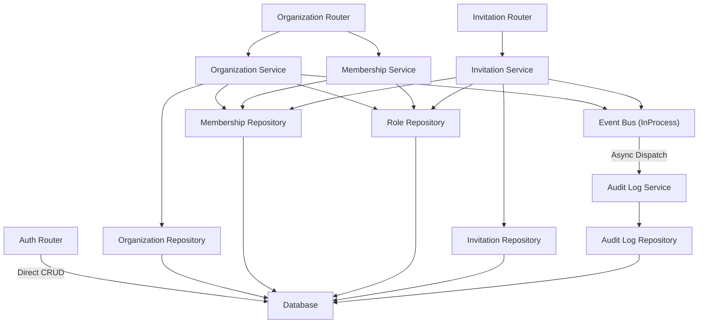

# Architecture Dependency Graph

This document proves that Calyx follows a strict acyclic dependency flow, and that business logic is properly isolated.

## Flow Rules
1. **Router Layer** handles HTTP requests, dependencies injection, transaction boundaries, and returns DTOs.
2. **Service Layer** handles business logic, domain events, authorization checks, and orchestrates repositories. Services own the transaction (`session.commit()`).
3. **Repository Layer** ONLY performs persistence. They do not contain business logic, and they do not own transactions.
4. **Database Layer** manages schema, constraints, and data.

## Mermaid Graph

As demonstrated, the architecture is strictly unidirectional.
