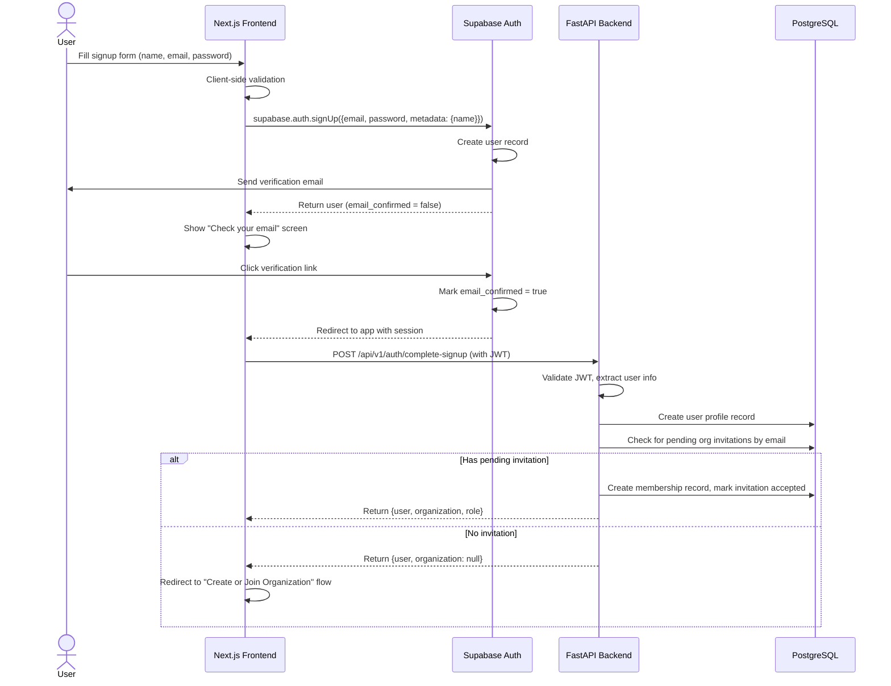
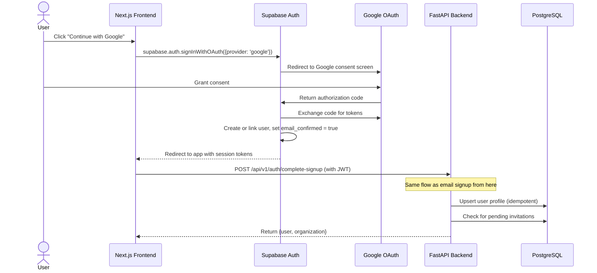
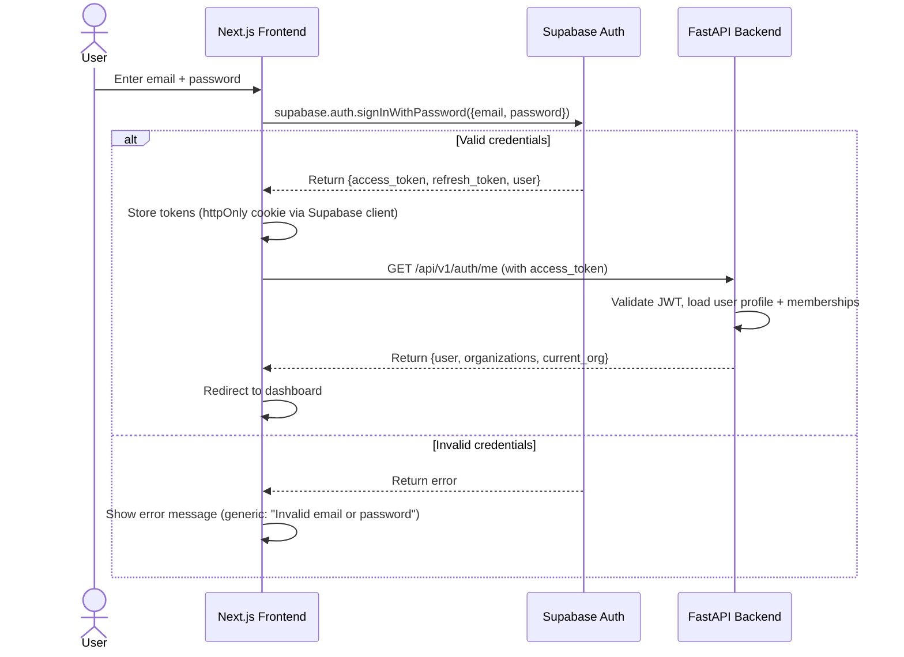
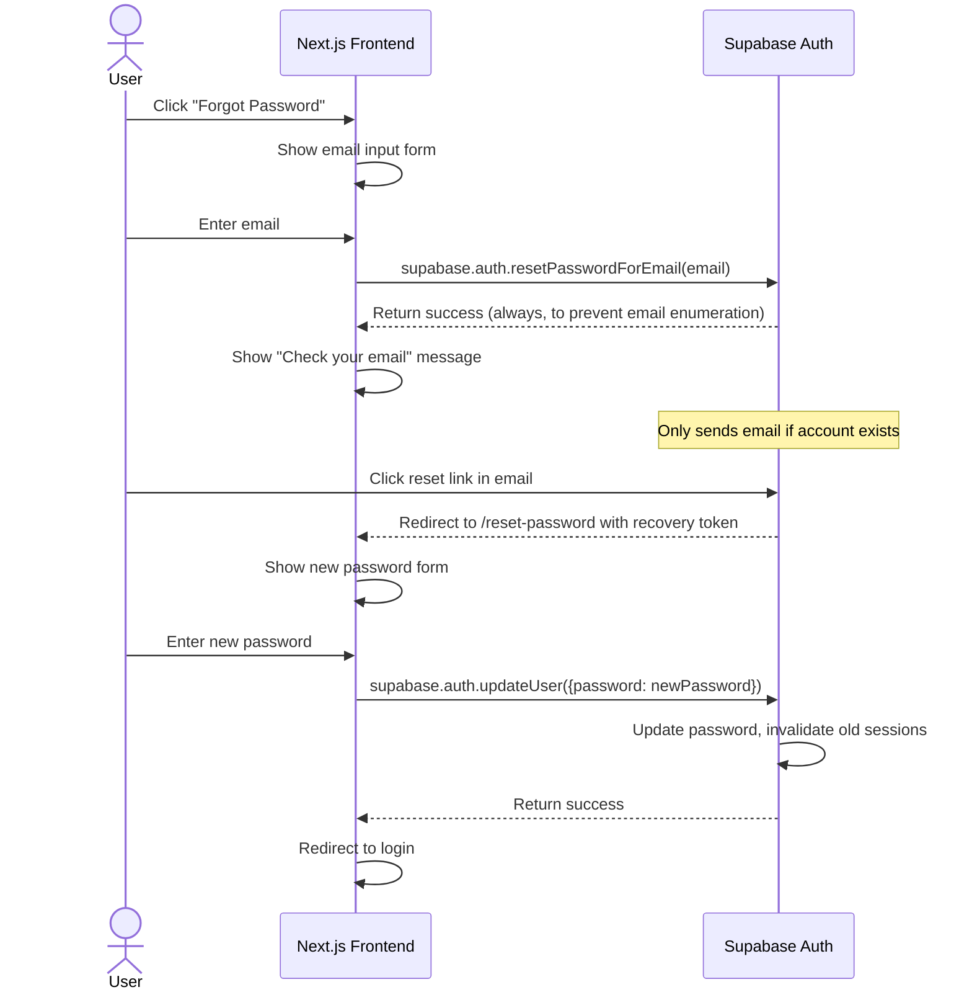

# Authentication Sequence Diagrams

**Version:** 1.0
**Status:** Approved
**Last Updated:** 2026-06-30
**Owner:** Architecture Team
**Related Documents:**
- [Security Model](../system/security-model.md)

---

