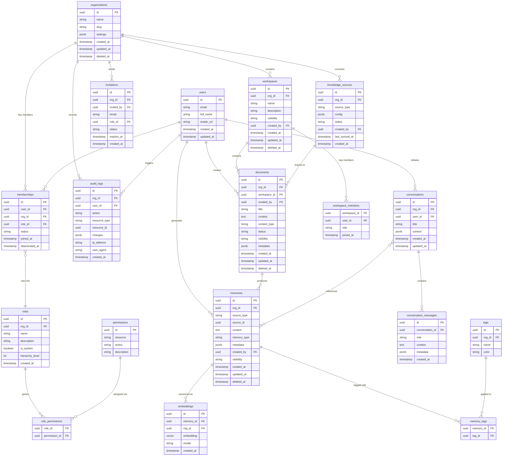

# Entity-Relationship Diagram

**Version:** 1.0
**Status:** Approved
**Last Updated:** 2026-06-30
**Owner:** Architecture Team
**Related Documents:**
- [Database Design](../system/database-design.md)

---

