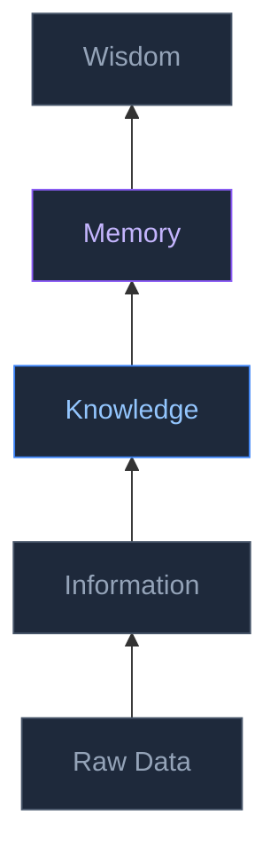
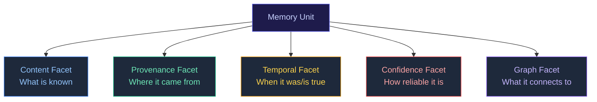
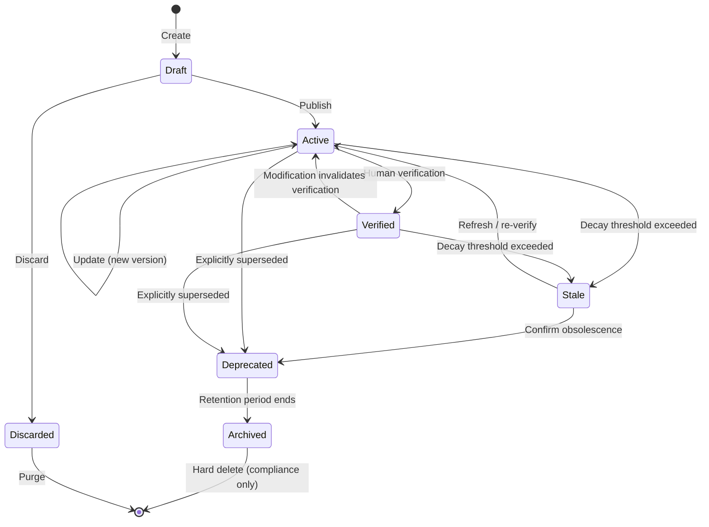
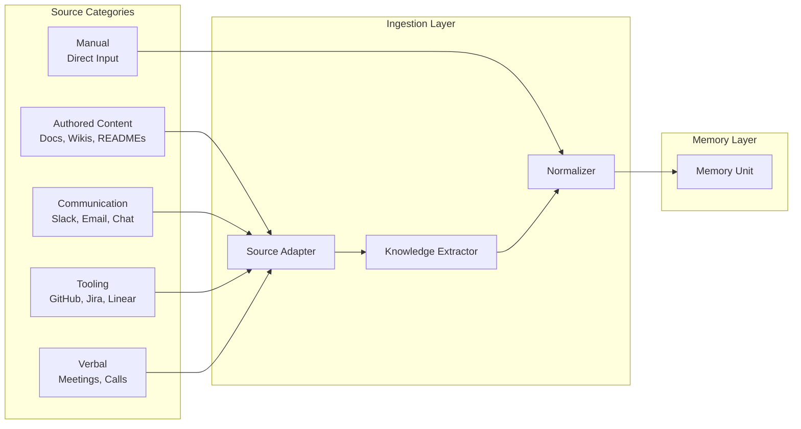
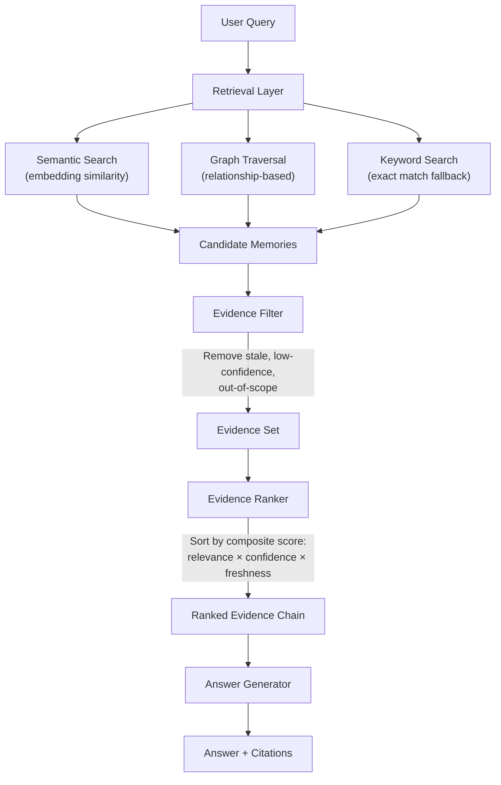
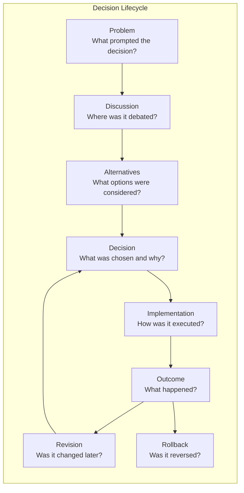
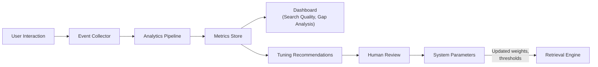
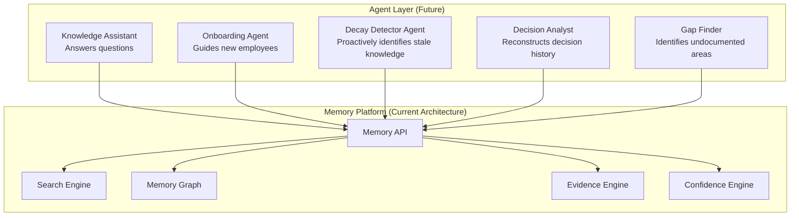

# Memory Graph Diagrams

**Version:** 1.0
**Status:** Approved
**Last Updated:** 2026-06-30
**Owner:** Architecture Team
**Related Documents:**
- [Memory Engine](../system/memory-engine.md)

---

