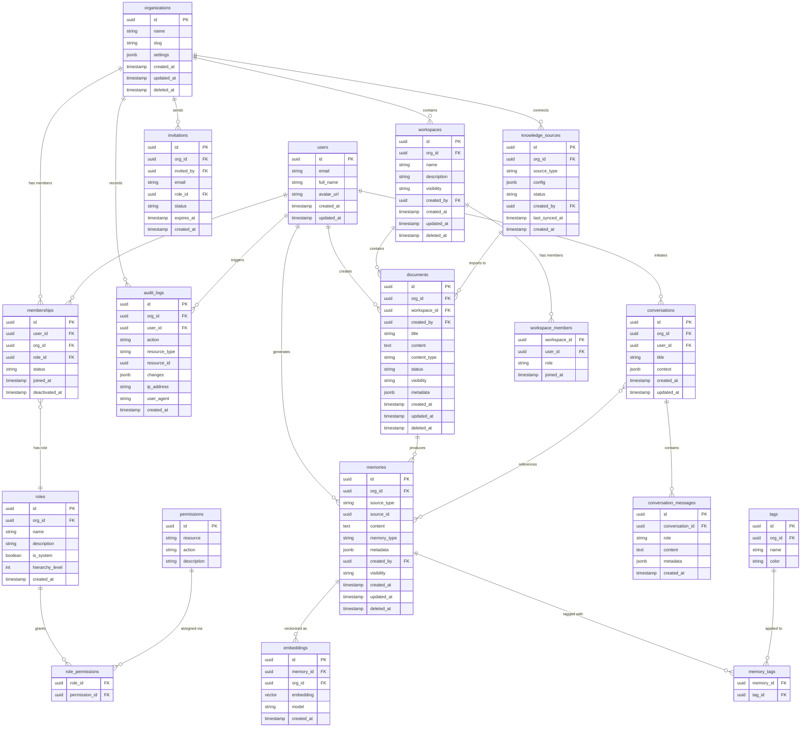

# Database Design & Data Ownership

**Version:** 1.0
**Status:** Approved
**Last Updated:** 2026-06-30
**Owner:** Architecture Team
**Related Documents:**
- [Multi-Tenancy](../system/multi-tenancy.md)

---

## 6.1 Ownership Model

Every object in Calyx has four ownership attributes:

| Attribute | Type | Purpose |
|---|---|---|
| `org_id` | UUID (FK → organizations) | Tenant boundary. Determines which organization owns this data. |
| `created_by` | UUID (FK → users) | The individual who created this record. |
| `visibility` | Enum | Who within the organization can see this. |
| `workspace_id` | UUID (FK → workspaces), nullable | Scopes the object to a workspace (for documents, memories). |

## 6.2 Visibility Levels

| Level | Meaning |
|---|---|
| `private` | Only the creator and Org Admins can see it. |
| `workspace` | Visible to all members of the parent workspace. |
| `organization` | Visible to all members of the organization. |

There is no `public` visibility in MVP. Calyx data never leaves the organizational boundary.

## 6.3 Deletion Policy

Calyx uses **soft deletion** for all user-facing content.

| Rule | Detail |
|---|---|
| **Soft delete** | All content tables have a `deleted_at` timestamp column. A non-null value means the record is "deleted." |
| **Query filtering** | All queries exclude soft-deleted records by default. A `include_deleted` flag is available for admin recovery operations. |
| **Retention period** | Soft-deleted records are retained for **90 days** (configurable per organization in the future). |
| **Hard delete** | After the retention period, a scheduled background job permanently removes the record and its associated embeddings. |
| **Cascade rules** | Deleting a workspace soft-deletes all documents and memories within it. Deleting an organization soft-deletes all workspaces, documents, memories, and memberships. |
| **User departure** | When a user is deactivated, their content is **not** deleted. It is re-owned by the organization (attributed to "Former Employee"). This is the core value proposition. |

> [!WARNING]
> Hard deletion of user data must comply with GDPR's Right to Erasure. When we add GDPR compliance tooling (post-MVP), we need a mechanism to hard-delete a user's personal data while preserving organizational knowledge they contributed. This requires separating *personal data* (name, email) from *organizational knowledge* (documents, decisions). The current schema supports this separation.

## 6.4 Audit Policy

Every state change is recorded in the `audit_logs` table.

| What is logged | Detail |
|---|---|
| **Create** | Who created what, when, in which org. |
| **Update** | Who changed what, when, previous and new values (for sensitive fields). |
| **Delete** | Who deleted what, when. Soft-delete and hard-delete are distinguished. |
| **Access** | Who accessed what (read), when. Configurable — off by default for performance, enable-able per org. |
| **Auth events** | Login, logout, password change, role change. |
| **Admin actions** | Member invite, role change, org settings change. |

**Audit log properties:**

- **Immutable:** Audit logs are append-only. No update or delete operations are permitted on the audit table.
- **Tamper-resistant:** The application-level database user does not have `UPDATE` or `DELETE` permissions on the `audit_logs` table.
- **Retention:** Audit logs are retained indefinitely in MVP. Retention policies will be configurable per org post-MVP.
- **Queryable:** Org Admins can filter audit logs by user, action, resource type, and date range.

---

## 7.1 Entity-Relationship Diagram

## 7.2 Key Design Decisions

| Decision | Rationale |
|---|---|
| **UUIDs for all primary keys** | Prevents enumeration attacks. Safe for distributed ID generation. Compatible with Supabase defaults. |
| **`org_id` on every tenant-scoped table** | Enables RLS and ensures tenant isolation is enforceable at the database level. |
| **`deleted_at` for soft deletion** | Preserves data for recovery and compliance. Partial index on `deleted_at IS NULL` keeps query performance optimal. |
| **`jsonb` for metadata and settings** | Flexible schema for fields that vary by context (document metadata, org settings, source config) without schema migrations. |
| **Separate `memories` and `embeddings` tables** | A single memory can have multiple embeddings (e.g., re-embedded with a newer model). Decoupling allows model upgrades without data loss. |
| **`source_type` + `source_id` polymorphic reference on memories** | A memory can be extracted from a document, a conversation, or a future integration source. Polymorphic reference avoids a separate junction table per source type. |
| **`roles` and `permissions` as database tables, not enums** | Enables custom roles and dynamic permission management without code deployments. |
| **`invitations` as a separate table** | Decouples the invitation lifecycle (pending → accepted/expired/revoked) from the membership lifecycle. Allows invitations to users who haven't signed up yet. |

## 7.3 Indexing Strategy (Conceptual)

| Index | Purpose |
|---|---|
| `memberships(user_id, org_id)` unique | One membership per user per org |
| `memberships(org_id)` | List members of an org |
| `documents(org_id, workspace_id, deleted_at)` | Workspace document listing |
| `documents(org_id, created_by)` | User's documents within an org |
| `memories(org_id, source_type, source_id)` | Find memories for a source |
| `embeddings(org_id)` + vector index (IVFFlat or HNSW) | Scoped vector similarity search |
| `audit_logs(org_id, created_at)` | Chronological audit log queries |
| `audit_logs(org_id, user_id, created_at)` | User-specific audit queries |
| `invitations(email, status)` | Lookup pending invitations for a new user |

> [!TIP]
> For pgvector, we will use **HNSW indexing** over IVFFlat. HNSW provides better recall at similar query speeds, doesn't require periodic retraining, and handles incremental inserts gracefully — all important for a system where knowledge is continuously added.

---
