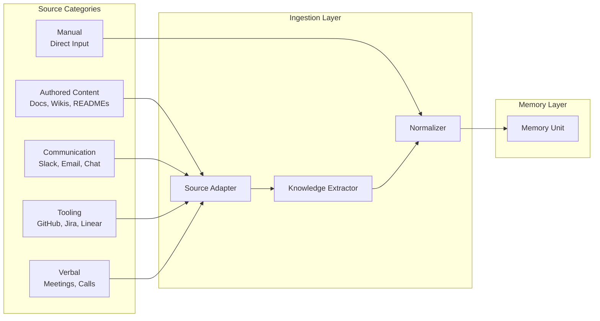

# Knowledge Extraction Pipeline

**Version:** 1.0
**Status:** Approved
**Last Updated:** 2026-06-30
**Owner:** Architecture Team
**Related Documents:**
- [Memory Engine](../system/memory-engine.md)

---

## 3.1 The Source-Agnostic Principle

Every knowledge source — whether it's a Google Doc, a Slack thread, a GitHub pull request, a Jira ticket, or a meeting transcript — must produce the **same internal representation**: a Memory.

This principle is the foundation of Calyx's architecture. Without it, every integration becomes a special case, search becomes fragmented, and the memory graph becomes a collection of disconnected silos.

**Why this matters:**

A decision might be:
- *Proposed* in a Slack thread
- *Debated* in a meeting
- *Documented* in a Google Doc
- *Implemented* in a GitHub PR
- *Tracked* in a Jira ticket

These are five different sources, five different formats, five different APIs — but they all describe the **same decision**. If Calyx treats each source as a separate artifact type, it cannot reconstruct the decision. If Calyx extracts memories from each source and connects them in the memory graph, it can.

## 3.2 Source Taxonomy

| Category | Sources | Characteristics |
|---|---|---|
| **Authored Content** | Google Docs, Notion pages, Confluence wikis, READMEs, PDFs, Word documents | Structured, long-form, intentionally created. Highest signal-to-noise ratio. |
| **Communication** | Slack messages/threads, email threads, Microsoft Teams chat | Unstructured, high volume, low signal-to-noise. Knowledge is buried in conversation. Requires intelligent extraction. |
| **Tooling** | GitHub PRs/issues/comments, Jira tickets, Linear issues, CI/CD logs | Semi-structured. Contains decisions, rationale, and technical context in comments and descriptions. |
| **Verbal** | Zoom recordings, Google Meet transcripts, in-person meeting notes | Unstructured, extremely high volume. Requires transcription + summarization + extraction. |
| **Manual** | Direct user input through Calyx UI | Structured by the user. Highest quality but lowest volume. |

## 3.3 Ingestion Pipeline

Every source goes through a three-stage pipeline:

### Stage 1: Source Adapter

Handles the mechanics of connecting to and reading from a source. Each adapter implements a standard interface:

| Responsibility | Detail |
|---|---|
| Authentication | OAuth tokens, API keys, webhooks — source-specific credential management |
| Data retrieval | Pull new/changed content since last sync. Handle pagination, rate limits, API quirks. |
| Change detection | Identify new, updated, and deleted content since the last sync. |
| Raw output | Produce a standardized intermediate format: `SourceDocument {source_type, source_ref, raw_content, content_type, metadata, timestamp}` |

The adapter does **not** interpret the content. It only retrieves and normalizes the format.

### Stage 2: Knowledge Extractor

Transforms raw source content into candidate memories. This is where intelligence lives.

| Responsibility | Detail |
|---|---|
| Content analysis | Identify knowledge-bearing passages (not everything in a Slack channel is knowledge). |
| Memory extraction | Extract structured memories from unstructured content. For authored content, this might be one memory per section. For a Slack thread, this might be one memory summarizing the decision. |
| Type classification | Assign a memory type (Fact, Decision, Process, etc.) based on content analysis. |
| Relationship suggestion | Suggest connections to existing memories (by semantic similarity and entity recognition). |
| Deduplication | Detect if the extracted memory already exists (or substantially overlaps with an existing memory). |

For MVP, the Knowledge Extractor uses LLM-based extraction with carefully designed prompts per source type. The prompts are source-specific because the structure of a Google Doc differs fundamentally from a Slack thread.

### Stage 3: Normalizer

Ensures every memory, regardless of origin, conforms to the memory unit schema (§2.2).

| Responsibility | Detail |
|---|---|
| Schema validation | Verify all required fields are populated. |
| Provenance tagging | Attach source references and extraction method metadata. |
| Embedding generation | Generate vector embeddings for the memory's summary and detail content. |
| Confidence initialization | Set initial confidence score based on source type and extraction method. |
| Graph integration | Create initial edges to detected entities (people, projects, systems). |

## 3.4 Why Universal Representation Matters

Consider the alternative: separate tables or models for "slack_memories," "github_memories," "document_memories." This creates:

- **Fragmented search.** Every query must search N tables. Ranking across source types is inconsistent.
- **Disconnected graph.** Relationships between memories of different source types require cross-table joins with no shared schema.
- **Integration tax.** Every new source type requires new tables, new search logic, new graph logic, new UI components.
- **Maintenance burden.** Bug fixes, schema changes, and feature additions must be applied N times.

With universal representation:

- **Unified search.** One table, one vector index, one ranking algorithm.
- **Connected graph.** All memories are nodes in the same graph, regardless of origin.
- **Integration simplicity.** A new source type requires only a new adapter and extractor. The memory layer, search, graph, and UI don't change.
- **Maintainability.** One schema to maintain, one set of tests, one set of APIs.

---
