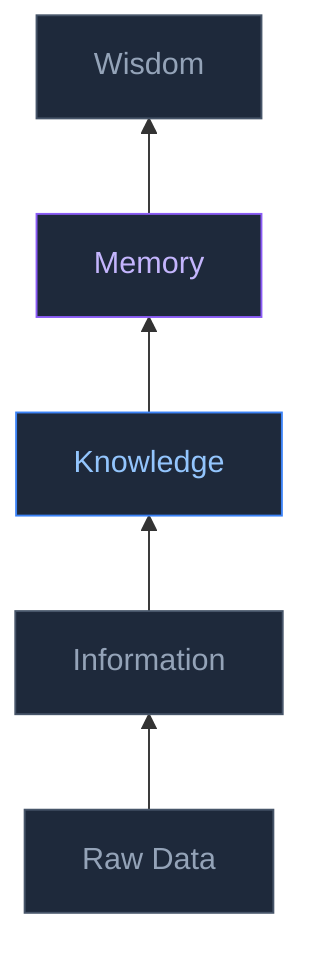
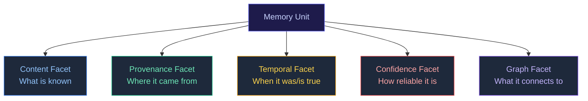
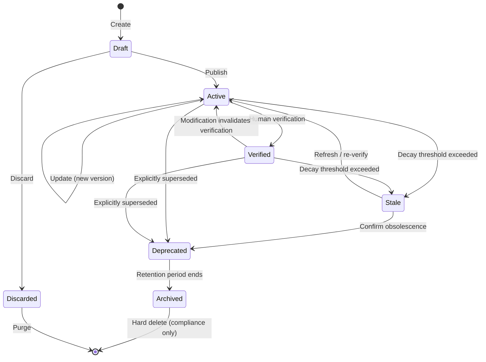
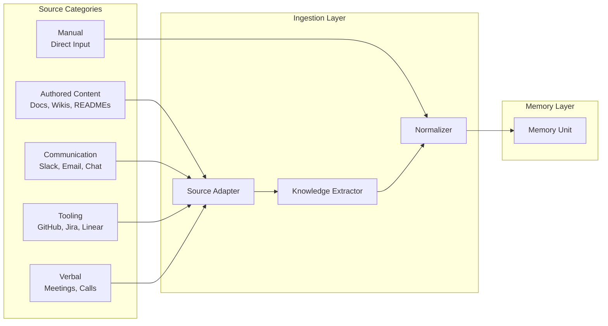
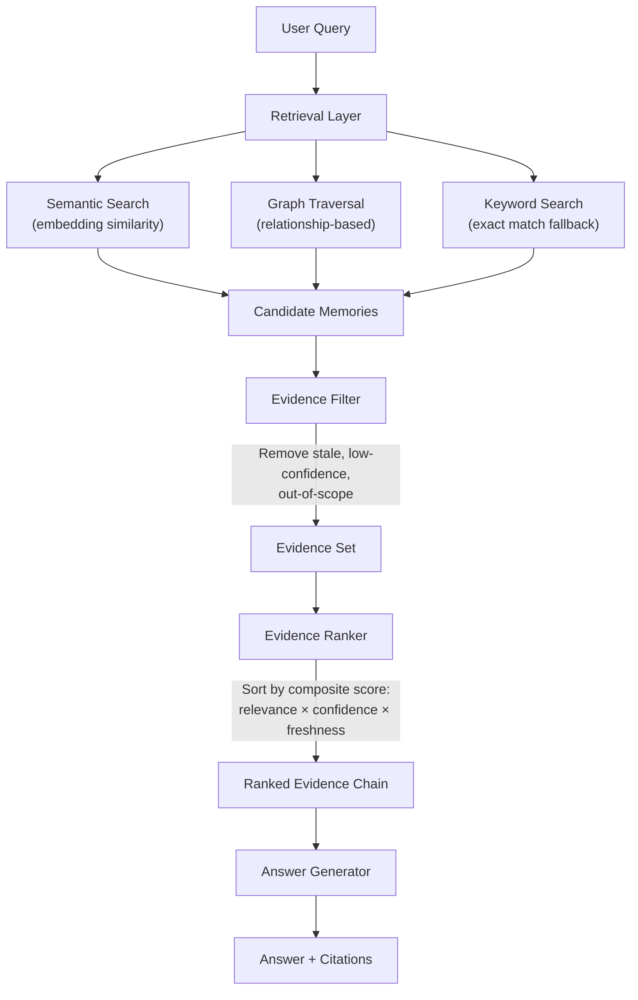
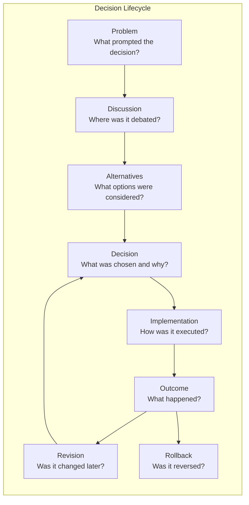
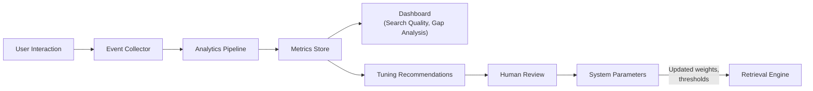
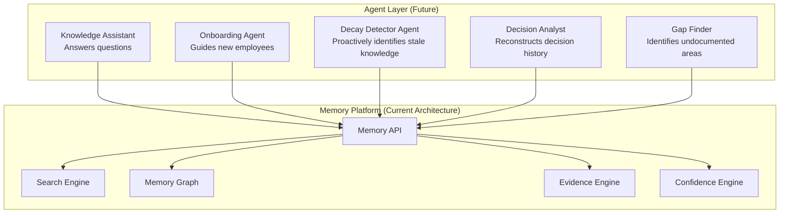

# Memory Engine Specification

**Version:** 1.0
**Status:** Approved
**Last Updated:** 2026-06-30
**Owner:** Architecture Team
**Related Documents:**
- [Knowledge Extraction](../system/knowledge-extraction.md)
- [Architecture Overview](../system/architecture-overview.md)

---

# Calyx Memory Engine Design Specification

**Document Type:** Foundational Architecture Specification
**Version:** 0.1.0
**Date:** 2026-06-30
**Status:** Draft — Pending Approval
**Classification:** This document defines the conceptual architecture that every future Calyx module depends on.

---

> *"An organization's most valuable asset isn't its code, its products, or its revenue. It's the accumulated understanding of why things are the way they are. When that understanding walks out the door, the organization doesn't just lose a person — it loses years of context that can never be fully reconstructed."*

---

# 1. What Is Knowledge?

## 1.1 The Knowledge Hierarchy

Most enterprise software conflates data, information, and knowledge. Calyx must not. The distinction is architecturally significant because each layer requires different storage, retrieval, and reasoning strategies.

### Raw Data

Unprocessed signals. A Slack message. A git diff. A meeting recording. A Jira status change. Raw data has no interpretation — it is a fact about something that happened.

**Example:** `"commit abc123 by alice@acme.com at 2026-03-15T14:32:00Z: refactored auth middleware"`

Calyx does **not** store raw data as its primary artifact. Raw data lives in source systems (Slack, GitHub, Google Drive). Calyx references it.

### Information

Data with context. Information answers "who, what, when, where" but not "why" or "so what."

**Example:** `"Alice refactored the auth middleware on March 15th in the payments-service repository."`

Information is derivable from raw data through extraction and structuring. Most search engines and RAG systems operate at the information layer. They can tell you *what* happened but not *why it matters*.

### Knowledge

Information connected to understanding. Knowledge answers "why" and "how." It embeds causal relationships, rationale, constraints, and context.

**Example:** `"Alice refactored the auth middleware because the original implementation used synchronous token validation, which caused p99 latency spikes above 500ms under load. The new implementation uses async validation with a local token cache (TTL: 5 minutes). This trade-off was accepted because the security team confirmed that a 5-minute stale token window is within acceptable risk for internal services."`

Knowledge requires human understanding to produce. It cannot be reliably generated from raw data alone — it emerges from the intersection of data, experience, and reasoning.

### Memory

Knowledge preserved with provenance, temporal context, confidence, relationships, and lifecycle state. Memory is knowledge that an organization can **depend on** — it has a known source, a known age, a known reliability, and known connections to other things the organization knows.

**Example:** The knowledge above, plus:
- *Source:* PR #1847 description + Alice's design doc in Google Drive + Slack thread #payments-perf
- *Confidence:* High (verified by Alice, corroborated by 3 sources)
- *Freshness:* Current (last verified June 2026)
- *Connections:* relates to [payments-service architecture], [auth middleware], [latency SLO decision from Q1 2026], [Alice Chen — Staff Engineer]
- *State:* Active

Memory is Calyx's primary storage layer.

### Wisdom

Pattern recognition across memories. Wisdom answers "what should we do" based on accumulated experience.

**Example:** `"Every time this organization has introduced a caching layer to solve a latency problem, the initial rollout has caused a cache invalidation incident within 30 days. Consider requiring a cache invalidation runbook before approving cache-based solutions."`

Wisdom is **not stored** — it is **derived** at query time by reasoning across the memory graph. It is the domain of future AI agents operating on top of the memory layer.

## 1.2 Where Calyx Operates

| Layer | Calyx's Role |
|---|---|
| **Raw Data** | References but does not store. Source systems are the system of record. |
| **Information** | Extracts from raw data during ingestion. Intermediate representation — not the final artifact. |
| **Knowledge** | Captures during memory creation (manual or AI-assisted). The substance of what is stored. |
| **Memory** | **Primary storage layer.** Knowledge enriched with provenance, confidence, relationships, and lifecycle. |
| **Wisdom** | Derived at query time. Future AI agent layer. Not stored — computed from the memory graph. |

> [!IMPORTANT]
> This distinction is not academic. It has direct architectural consequences:
> - We do not build a "document store." We build a **memory store**.
> - We do not index "files." We extract and store **knowledge with provenance**.
> - We do not search "text." We traverse a **memory graph with confidence scoring**.
> - We do not answer questions from "context windows." We assemble **evidence chains from verified memories**.

---

# 2. What Is a Memory?

## 2.1 Definition

A **Memory** is the atomic unit of organizational knowledge in Calyx. It is the smallest self-contained piece of knowledge that an organization can store, verify, connect, evolve, and retrieve.

A memory is **not** a document. A single document may produce zero, one, or many memories. A single Slack thread may produce a memory. A meeting transcript may produce dozens. A memory can also be created directly by a human without any source document.

## 2.2 Anatomy of a Memory

Every memory has five facets:

### Content Facet

| Attribute | Description |
|---|---|
| `summary` | A concise, human-readable statement of the knowledge (1–3 sentences). This is what surfaces in search results. |
| `detail` | The full knowledge content. Structured text (Markdown). Can include code snippets, diagrams, tables. |
| `memory_type` | The category of knowledge (see §2.3). |
| `tags` | Organizational taxonomy tags for classification. |

### Provenance Facet

| Attribute | Description |
|---|---|
| `source_type` | The kind of source (manual, document, slack, github, jira, meeting, email, conversation, etc.). |
| `source_ref` | A reference to the original source (URL, document ID, message ID). |
| `extraction_method` | How this memory was created (human_authored, ai_extracted, ai_assisted, imported). |
| `created_by` | The user who created or triggered the creation. |
| `created_at` | Timestamp of creation. |

### Temporal Facet

| Attribute | Description |
|---|---|
| `valid_from` | When this knowledge became true (may differ from `created_at` — e.g., a memory about a Q1 decision created in Q2). |
| `valid_until` | When this knowledge stopped being true (null if still current). |
| `last_verified_at` | When a human last confirmed this memory is still accurate. |
| `verification_due_at` | When the next verification is due (based on the verification schedule). |
| `version` | The version number of this memory (incremented on content updates). |

### Confidence Facet

| Attribute | Description |
|---|---|
| `confidence_score` | A computed score from 0.0 to 1.0 (see §8: Confidence Engine). |
| `verification_status` | `unverified`, `verified`, `disputed`, `deprecated`. |
| `corroboration_count` | Number of independent sources supporting this memory. |
| `contradiction_count` | Number of sources contradicting this memory. |

### Graph Facet

| Attribute | Description |
|---|---|
| `connections` | Typed edges to other nodes in the memory graph (see §4: Memory Graph). |
| `org_id` | The organization this memory belongs to. |
| `workspace_id` | The workspace scope (optional). |
| `visibility` | `private`, `workspace`, `organization`. |

## 2.3 Memory Types

Not all knowledge is the same. Different types of knowledge have different structures, different decay rates, different verification needs, and different retrieval patterns.

| Type | Description | Example | Decay Profile |
|---|---|---|---|
| **Fact** | A verifiable statement about the current state of something. | "The payments service uses PostgreSQL 15 on AWS RDS." | Medium — facts change when systems change. |
| **Decision** | A choice made between alternatives, with rationale. | "We chose gRPC over REST for inter-service communication because..." | Low — decisions are historical. But their *applicability* decays. |
| **Process** | A sequence of steps to accomplish something. | "To deploy to production: 1. Create a release branch..." | High — processes change frequently. |
| **Context** | Background information that helps someone understand a situation. | "Client Acme has a custom SLA that requires 4-hour response times." | Medium — context changes with relationships. |
| **Event** | A record of something that happened. | "On 2026-03-15, the auth service experienced a 4-hour outage due to..." | None — events are immutable historical records. |
| **Relationship** | A connection between people, teams, systems, or concepts. | "Alice Chen is the primary on-call for the payments service." | High — people change roles frequently. |
| **Lesson** | An insight derived from experience. | "Never run database migrations during peak traffic hours — we learned this after the incident on 2026-01-20." | Low — lessons are durable. But they can be superseded by new lessons. |
| **Specification** | A technical or business specification. | "The API rate limit for free-tier users is 100 requests per minute." | Medium — specs change with product decisions. |

> [!NOTE]
> Memory types are not rigid categories — they are a classification aid. A single piece of knowledge might be both a Decision and a Lesson. The type determines default decay profiles and verification schedules, but these can be overridden.

## 2.4 Memory Lifecycle

Every memory moves through a defined lifecycle. Transitions are explicit, auditable, and reversible (except for hard deletion).

| State | Meaning | Searchable | Editable |
|---|---|---|---|
| **Draft** | Memory is being authored or refined. Not yet visible to others. | No (only by creator) | Yes |
| **Active** | Memory is published and considered current knowledge. | Yes | Yes (creates new version) |
| **Verified** | A human has confirmed this memory is accurate and current. | Yes (boosted ranking) | Yes (reverts to Active) |
| **Stale** | Calyx has detected signals that this memory may be outdated (see §10: Knowledge Decay). | Yes (with staleness warning) | Yes |
| **Deprecated** | This memory is no longer current. It has been explicitly superseded or marked obsolete. | Yes (with deprecation notice, lower ranking) | No (read-only, can be un-deprecated) |
| **Archived** | Moved to historical record after the retention period. Preserved for compliance and historical reference. | Only via explicit archive search | No |
| **Discarded** | Draft that was abandoned before publication. | No | No |

### Lifecycle Events

Each state transition generates:
- An audit log entry
- A notification to relevant stakeholders (configurable)
- An update to the memory's confidence score
- A re-indexing of the memory's embeddings (if content changed)

## 2.5 Memory Creation

Memories enter Calyx through four pathways:

| Pathway | Description | Quality | Volume |
|---|---|---|---|
| **Human-authored** | A user manually creates a memory through the Calyx UI. Highest quality — the human provides structured knowledge directly. | Highest | Low |
| **AI-extracted** | An automated pipeline extracts memories from ingested sources (documents, Slack, meetings). AI identifies knowledge-bearing content and structures it. | Medium — requires human review | High |
| **AI-assisted** | A human creates a memory with AI assistance (e.g., AI drafts from a source, human refines). | High | Medium |
| **Imported** | Bulk import from an external system during onboarding. | Variable | High (one-time) |

**AI-extracted memories always start in Draft or Active-Unverified state.** They are never auto-verified. Human verification is the quality gate.

## 2.6 Memory Updates

When a memory is updated:

1. The current content is snapshotted as a historical version.
2. The new content replaces the current content.
3. The version number increments.
4. If the memory was in `Verified` state, it reverts to `Active` (the verification was for the *previous* content).
5. The confidence score is recalculated.
6. Embeddings are regenerated for the new content.
7. An audit log entry records the change, the author, and the diff.

Historical versions are **never deleted** (except for compliance-driven hard deletion). Any version can be viewed and compared.

## 2.7 Memory Verification

Verification is the act of a human confirming that a memory is still accurate and current.

- Any member with `Employee` role or above can verify memories they have access to.
- Verification records *who* verified and *when*.
- Verification does not change the content — it is a statement of "I confirm this is still true."
- Organizations can set verification schedules per memory type (e.g., "Processes must be re-verified every 90 days").
- Overdue verifications generate notifications and lower the confidence score.

## 2.8 Memory Archival and Deletion

| Action | Trigger | Reversible | Data |
|---|---|---|---|
| **Soft archive** | Retention period expires after deprecation, or manual archive | Yes (un-archive) | Content preserved, removed from active search index |
| **Hard delete** | GDPR/compliance request, or manual deletion by Org Admin | No | Content destroyed, audit log entry preserved with redacted reference |

Hard deletion is rare and requires Org Admin authorization. It is the nuclear option — used for legal compliance, not for knowledge management.

---

# 3. Knowledge Sources

## 3.1 The Source-Agnostic Principle

Every knowledge source — whether it's a Google Doc, a Slack thread, a GitHub pull request, a Jira ticket, or a meeting transcript — must produce the **same internal representation**: a Memory.

This principle is the foundation of Calyx's architecture. Without it, every integration becomes a special case, search becomes fragmented, and the memory graph becomes a collection of disconnected silos.

**Why this matters:**

A decision might be:
- *Proposed* in a Slack thread
- *Debated* in a meeting
- *Documented* in a Google Doc
- *Implemented* in a GitHub PR
- *Tracked* in a Jira ticket

These are five different sources, five different formats, five different APIs — but they all describe the **same decision**. If Calyx treats each source as a separate artifact type, it cannot reconstruct the decision. If Calyx extracts memories from each source and connects them in the memory graph, it can.

## 3.2 Source Taxonomy

| Category | Sources | Characteristics |
|---|---|---|
| **Authored Content** | Google Docs, Notion pages, Confluence wikis, READMEs, PDFs, Word documents | Structured, long-form, intentionally created. Highest signal-to-noise ratio. |
| **Communication** | Slack messages/threads, email threads, Microsoft Teams chat | Unstructured, high volume, low signal-to-noise. Knowledge is buried in conversation. Requires intelligent extraction. |
| **Tooling** | GitHub PRs/issues/comments, Jira tickets, Linear issues, CI/CD logs | Semi-structured. Contains decisions, rationale, and technical context in comments and descriptions. |
| **Verbal** | Zoom recordings, Google Meet transcripts, in-person meeting notes | Unstructured, extremely high volume. Requires transcription + summarization + extraction. |
| **Manual** | Direct user input through Calyx UI | Structured by the user. Highest quality but lowest volume. |

## 3.3 Ingestion Pipeline

Every source goes through a three-stage pipeline:

### Stage 1: Source Adapter

Handles the mechanics of connecting to and reading from a source. Each adapter implements a standard interface:

| Responsibility | Detail |
|---|---|
| Authentication | OAuth tokens, API keys, webhooks — source-specific credential management |
| Data retrieval | Pull new/changed content since last sync. Handle pagination, rate limits, API quirks. |
| Change detection | Identify new, updated, and deleted content since the last sync. |
| Raw output | Produce a standardized intermediate format: `SourceDocument {source_type, source_ref, raw_content, content_type, metadata, timestamp}` |

The adapter does **not** interpret the content. It only retrieves and normalizes the format.

### Stage 2: Knowledge Extractor

Transforms raw source content into candidate memories. This is where intelligence lives.

| Responsibility | Detail |
|---|---|
| Content analysis | Identify knowledge-bearing passages (not everything in a Slack channel is knowledge). |
| Memory extraction | Extract structured memories from unstructured content. For authored content, this might be one memory per section. For a Slack thread, this might be one memory summarizing the decision. |
| Type classification | Assign a memory type (Fact, Decision, Process, etc.) based on content analysis. |
| Relationship suggestion | Suggest connections to existing memories (by semantic similarity and entity recognition). |
| Deduplication | Detect if the extracted memory already exists (or substantially overlaps with an existing memory). |

For MVP, the Knowledge Extractor uses LLM-based extraction with carefully designed prompts per source type. The prompts are source-specific because the structure of a Google Doc differs fundamentally from a Slack thread.

### Stage 3: Normalizer

Ensures every memory, regardless of origin, conforms to the memory unit schema (§2.2).

| Responsibility | Detail |
|---|---|
| Schema validation | Verify all required fields are populated. |
| Provenance tagging | Attach source references and extraction method metadata. |
| Embedding generation | Generate vector embeddings for the memory's summary and detail content. |
| Confidence initialization | Set initial confidence score based on source type and extraction method. |
| Graph integration | Create initial edges to detected entities (people, projects, systems). |

## 3.4 Why Universal Representation Matters

Consider the alternative: separate tables or models for "slack_memories," "github_memories," "document_memories." This creates:

- **Fragmented search.** Every query must search N tables. Ranking across source types is inconsistent.
- **Disconnected graph.** Relationships between memories of different source types require cross-table joins with no shared schema.
- **Integration tax.** Every new source type requires new tables, new search logic, new graph logic, new UI components.
- **Maintenance burden.** Bug fixes, schema changes, and feature additions must be applied N times.

With universal representation:

- **Unified search.** One table, one vector index, one ranking algorithm.
- **Connected graph.** All memories are nodes in the same graph, regardless of origin.
- **Integration simplicity.** A new source type requires only a new adapter and extractor. The memory layer, search, graph, and UI don't change.
- **Maintainability.** One schema to maintain, one set of tests, one set of APIs.

---

# 4. Memory Graph

## 4.1 Why a Graph?

Knowledge is inherently connected. A fact about a system relates to the person who built it, the decision that shaped it, the project it belongs to, the client it serves, and the incident it caused. These relationships are as valuable as the knowledge itself — often more so.

**What a user actually asks is rarely "give me document X." They ask:**

- "Why did we choose PostgreSQL for the payments service?"
- "What does Alice know that nobody else does?"
- "What decisions did we make about the Acme client's integration?"
- "Who should I talk to about the billing service?"
- "What broke the last time we changed the auth middleware?"

Answering these questions requires traversing relationships — following edges in a graph from the question to the evidence.

## 4.2 Graph Structure

The memory graph consists of **nodes** and **typed edges**.

### Node Types

| Node Type | Description | Examples |
|---|---|---|
| **Memory** | The primary node. An atomic unit of knowledge. | "PostgreSQL was chosen for payments because..." |
| **Person** | An individual within the organization. | Alice Chen, Bob Martinez |
| **Team** | A group of people. | Payments Team, Platform Engineering |
| **Project** | A body of work with a defined scope. | "Payments v2 Migration", "Acme Integration" |
| **System** | A technical component, service, or tool. | "payments-service", "auth-middleware", "PostgreSQL" |
| **Client** | An external entity the organization serves. | Acme Corp, Globex Industries |
| **Meeting** | A recorded or noted meeting. | "Architecture Review 2026-03-15" |
| **Incident** | An operational incident. | "AUTH-2026-0315: Auth service outage" |
| **Decision** | A first-class decision node (see §6: Decision Intelligence). | "DECISION-042: Adopt gRPC for inter-service communication" |
| **Document** | A source document (reference, not the document itself). | "payments-architecture.md in Google Drive" |
| **Workspace** | A Calyx workspace. | "Engineering", "Client Success" |
| **Tag** | A classification label. | "architecture", "security", "deprecated" |

### Edge Types

| Edge Type | Direction | Example |
|---|---|---|
| `authored_by` | Memory → Person | "This memory was written by Alice" |
| `verified_by` | Memory → Person | "This memory was verified by Bob" |
| `owned_by` | Memory → Person | "Alice is the knowledge owner" |
| `relates_to` | Memory ↔ Memory | "This memory is related to that memory" |
| `supersedes` | Memory → Memory | "This memory replaces that older memory" |
| `contradicts` | Memory ↔ Memory | "These two memories conflict" |
| `supports` | Memory → Memory | "This memory provides evidence for that memory" |
| `derived_from` | Memory → Memory | "This memory was extracted from / summarized from that memory" |
| `about_person` | Memory → Person | "This memory concerns Alice" |
| `about_project` | Memory → Project | "This memory relates to the Payments v2 project" |
| `about_system` | Memory → System | "This memory describes the auth middleware" |
| `about_client` | Memory → Client | "This memory is about the Acme engagement" |
| `decided_in` | Decision → Meeting | "This decision was made during the architecture review" |
| `caused_by` | Incident → Memory | "This incident was caused by the issue described in this memory" |
| `resolved_by` | Incident → Memory | "This incident was resolved by the approach described in this memory" |
| `belongs_to` | * → Workspace | "This entity is scoped to this workspace" |
| `member_of` | Person → Team | "Alice is on the Payments Team" |
| `leads` | Person → Project | "Bob leads the Acme Integration" |

### Edge Metadata

Every edge carries:

| Attribute | Purpose |
|---|---|
| `edge_type` | The relationship type (from the catalog above) |
| `strength` | How strong the relationship is (0.0–1.0). AI-suggested edges start at lower strength; human-confirmed edges are higher. |
| `created_at` | When the relationship was established |
| `created_by` | Who created it (user or system) |
| `metadata` | Additional context (e.g., for `supersedes`: the reason for supersession) |

## 4.3 Graph Traversal Patterns

The graph supports common organizational queries through traversal:

| Query Type | Traversal Pattern |
|---|---|
| **"What do we know about X?"** | Find all Memory nodes connected to entity X (person, system, project, client). Rank by confidence and freshness. |
| **"Who knows about X?"** | Find entity X → traverse `about_*` edges to Memories → traverse `authored_by` / `owned_by` edges to Persons. Rank persons by number and quality of connections. |
| **"Why did we decide X?"** | Find Decision node X → traverse to connected Memories (problem, discussion, alternatives, rationale). Reconstruct the decision narrative. |
| **"What's at risk if Alice leaves?"** | Find Person Alice → traverse `authored_by` / `owned_by` edges to Memories → identify memories where Alice is the sole author/owner. These represent single-person dependencies. |
| **"What changed about X since date Y?"** | Find entity X → traverse to Memories with `valid_from` > Y or `updated_at` > Y. Show the evolution. |
| **"What broke after we changed X?"** | Find System X → traverse to Incidents `caused_by` memories `about_system` X. Correlate with recent memory changes. |

## 4.4 PostgreSQL Implementation for MVP

A dedicated graph database is not required for MVP. PostgreSQL can represent the memory graph using:

### Node Storage

Each node type has its own table (as defined in the ER diagram from the Design Review): `memories`, `users` (Persons), `projects`, `systems`, `clients`, etc.

For entity types that are not first-class tables in the MVP (Teams, Systems, Clients, Projects), we use a single **`entities`** table:

| Column | Type | Purpose |
|---|---|---|
| `id` | UUID | Primary key |
| `org_id` | UUID | Tenant isolation |
| `entity_type` | Enum | `person`, `team`, `project`, `system`, `client`, `incident`, `meeting` |
| `name` | Text | Display name |
| `metadata` | JSONB | Type-specific attributes |
| `created_at` | Timestamp | |
| `updated_at` | Timestamp | |

### Edge Storage

A single **`memory_edges`** table stores all relationships:

| Column | Type | Purpose |
|---|---|---|
| `id` | UUID | Primary key |
| `org_id` | UUID | Tenant isolation |
| `source_node_type` | Enum | The type of the source node |
| `source_node_id` | UUID | The source node |
| `edge_type` | Enum | Relationship type |
| `target_node_type` | Enum | The type of the target node |
| `target_node_id` | UUID | The target node |
| `strength` | Float | Relationship strength |
| `metadata` | JSONB | Edge-specific context |
| `created_by` | UUID | Who created this edge |
| `created_at` | Timestamp | |

### Query Performance

For MVP-scale data (thousands to low tens of thousands of nodes per org):

- **1-hop queries** (find all directly connected nodes): Single indexed join. Sub-millisecond.
- **2-hop queries** (find nodes connected through an intermediate node): Two joins. Low milliseconds.
- **3+ hop queries**: Multiple joins. Performance depends on graph density. Acceptable for MVP scale.

**Indexes:**
- `memory_edges(org_id, source_node_type, source_node_id)`
- `memory_edges(org_id, target_node_type, target_node_id)`
- `memory_edges(org_id, edge_type)`

## 4.5 Future Graph Implementation

When the graph grows beyond what PostgreSQL handles efficiently (hundreds of thousands of nodes, millions of edges, frequent 3+ hop traversals):

**Option A: PostgreSQL + Apache AGE extension**
- AGE adds Cypher query language and graph processing to PostgreSQL.
- No infrastructure change — it's an extension.
- Trades query expressiveness for operational simplicity.

**Option B: Dedicated graph database (Neo4j / Amazon Neptune)**
- Optimal for complex traversals, pathfinding, graph algorithms.
- Requires syncing data between PostgreSQL (primary) and the graph DB (secondary index).
- The memory graph becomes a **materialized view** of the relational data.

**Option C: Hybrid — PostgreSQL for storage, graph DB for queries**
- Write to PostgreSQL (source of truth).
- Async sync to graph DB.
- Query the graph DB for traversals.
- This is the pattern used by LinkedIn, Twitter, and similar graph-heavy applications.

The current design supports all three options because:
- The `entities` + `memory_edges` tables are a clean relational representation of a property graph.
- Migration to any graph DB involves exporting nodes and edges, not restructuring the domain model.
- The service layer queries through repository interfaces — swapping the graph query backend is a repository change, not a service change.

---

# 5. Evidence Model

## 5.1 The Evidence Principle

> **Every answer Calyx generates must be traceable to its source memories. An answer without evidence is an opinion. Calyx does not offer opinions.**

This principle distinguishes Calyx from general-purpose AI assistants. When a user asks "Why did we choose PostgreSQL?", the answer must include:

- The specific memories that inform the answer
- The confidence in each memory
- The freshness of each memory
- A link back to the original source

## 5.2 Evidence Structure

When Calyx retrieves memories to answer a query, each contributing memory is wrapped in an **Evidence** envelope:

| Attribute | Type | Description |
|---|---|---|
| `memory_id` | UUID | The memory providing evidence |
| `memory_summary` | Text | The memory's summary (for display) |
| `relevance_score` | Float (0.0–1.0) | How relevant this memory is to the query (semantic similarity + graph distance) |
| `confidence_score` | Float (0.0–1.0) | How reliable this memory is (from the Confidence Engine) |
| `freshness_score` | Float (0.0–1.0) | How current this memory is (based on age and verification status) |
| `verification_status` | Enum | `unverified`, `verified`, `disputed`, `deprecated` |
| `source_type` | String | Where the memory originally came from |
| `source_ref` | String/URL | Link to the original source |
| `authored_by` | Person reference | Who created this memory |
| `last_verified_by` | Person reference | Who last verified this memory (if verified) |
| `last_verified_at` | Timestamp | When it was last verified |

## 5.3 Evidence Assembly

When answering a query, Calyx assembles an **Evidence Chain**:

### Evidence Scoring

Each piece of evidence receives a **composite score**:

$$\text{evidence\_score} = w_r \cdot \text{relevance} + w_c \cdot \text{confidence} + w_f \cdot \text{freshness}$$

Default weights: $w_r = 0.5$, $w_c = 0.3$, $w_f = 0.2$

These weights are tunable and will be adjusted based on user feedback data from the Learning Loop (§12).

### Evidence Sufficiency

Before generating an answer, Calyx checks:

| Check | Action if failed |
|---|---|
| **No evidence found** | Return "I don't have knowledge about this topic" — never fabricate. |
| **All evidence is stale** | Return answer with a prominent staleness warning. |
| **Evidence is contradictory** | Return answer acknowledging the contradiction, presenting both sides with their respective confidence scores. |
| **Low overall confidence** | Return answer with a confidence disclaimer and suggest verification. |

## 5.4 Evidence Lineage

For any answer, a user can "drill down" to see:

1. **The answer** — the synthesized response
2. **The evidence** — the ranked list of contributing memories
3. **The source** — for each memory, the original source (document, Slack thread, PR, meeting, etc.)
4. **The author** — who created the memory and who last verified it

This three-level drill-down is the transparency guarantee. It is what makes Calyx trustworthy for enterprise use.

## 5.5 Evidence Ownership

| Role | Responsibility |
|---|---|
| **Memory author** | Responsible for the accuracy of the memory's content |
| **Memory verifier** | Responsible for confirming the memory is still current |
| **Answer consumer** | Responsible for evaluating the evidence and deciding whether to act on it |
| **Calyx (system)** | Responsible for accurately scoring, ranking, and citing evidence. Never responsible for the truth of the underlying knowledge. |

> [!IMPORTANT]
> Calyx is an evidence engine, not a truth engine. It surfaces what the organization knows, scores its reliability, and cites its sources. It does not guarantee that the underlying knowledge is correct — that is the responsibility of the humans who create and verify memories.

---

# 6. Decision Intelligence

## 6.1 Why Decisions Matter

Decisions are the most valuable — and most fragile — form of organizational knowledge.

Every organization makes thousands of decisions: technology choices, product priorities, hiring strategies, client terms, architectural trade-offs. The context behind these decisions lives in the heads of the people who made them — in meeting discussions, Slack debates, and hallway conversations that are never documented.

When those people leave, the organization loses not just the decision (which might be recorded somewhere) but the **why** — the alternatives considered, the trade-offs weighed, the constraints that shaped the choice. Without the "why," future teams either:

1. **Repeat the same decision process**, wasting time rediscovering what was already known.
2. **Reverse the decision without understanding it**, causing regressions.
3. **Build on assumptions they don't know are wrong**, compounding errors.

Calyx's Decision Intelligence capability reconstructs and preserves the full lifecycle of organizational decisions.

## 6.2 Decision Model

A Decision in Calyx is a **first-class entity** — not just another memory type, but a structured node in the memory graph with its own lifecycle.

### Decision Attributes

| Phase | Attribute | Description |
|---|---|---|
| **Problem** | `problem_statement` | What problem or opportunity triggered this decision? |
| | `context_memories` | Links to memories that describe the context |
| | `urgency` | How time-sensitive was the decision? |
| | `raised_by` | Who identified the problem? |
| | `raised_at` | When was it identified? |
| **Discussion** | `participants` | Who was involved in the decision process? |
| | `discussion_memories` | Links to memories from meetings, Slack threads, documents where the decision was discussed |
| | `duration` | How long was the deliberation? |
| **Alternatives** | `alternatives[]` | Each alternative: {description, pros, cons, champion, estimated_effort, estimated_risk} |
| | `evaluation_criteria` | What criteria were used to evaluate alternatives? |
| **Decision** | `chosen_alternative` | Which alternative was selected? |
| | `rationale` | Why this alternative over others — in the decision-makers' own words |
| | `decided_by` | Who made the final call? (Individual or group) |
| | `decided_at` | When was the decision finalized? |
| | `constraints` | What constraints influenced the choice? (Time, budget, team, tech) |
| | `risks_accepted` | What known risks were accepted? |
| **Implementation** | `implementation_memories` | Links to PRs, tickets, documents describing the implementation |
| | `implemented_by` | Who executed it? |
| | `completed_at` | When was implementation finished? |
| **Outcome** | `outcome_description` | What actually happened? |
| | `success_metrics` | Was the decision successful by its own criteria? |
| | `unintended_consequences` | Any surprises? |
| | `outcome_assessed_at` | When was the outcome assessed? |
| **Revision** | `revision_decisions` | Links to subsequent decisions that modified this one |
| | `revision_reason` | Why was it revised? |
| **Rollback** | `rolled_back` | Boolean — was this decision fully reversed? |
| | `rollback_reason` | Why? |
| | `rollback_decision` | Link to the decision that reversed this one |

## 6.3 Decision Discovery

Decisions often aren't explicitly labeled. Calyx must discover them:

| Source | Detection Signal |
|---|---|
| **Meetings** | Phrases like "let's go with," "we've decided," "the plan is," "after discussing, we'll…" |
| **Slack** | Threads with debate patterns (multiple participants, pro/con language, resolution statements) |
| **PRs/Issues** | Titles or descriptions containing "RFC," "ADR," "proposal," "decision" |
| **Documents** | Sections titled "Decision," "Approach," "Why we chose," "Trade-offs" |
| **Manual** | User explicitly creates a decision record through the Calyx UI |

For MVP, decision discovery is primarily manual (users create decisions) and AI-assisted (AI suggests potential decisions from ingested content for human confirmation). Fully automated decision discovery from communication streams is a post-MVP capability.

## 6.4 Decision Graph

Decisions form their own subgraph within the memory graph:

- Decisions connect to **People** (who decided, who was affected)
- Decisions connect to **Systems** (what was changed)
- Decisions connect to **Projects** (what scope)
- Decisions connect to **other Decisions** (supersession, revision, enabling/blocking)
- Decisions connect to **Incidents** (decisions that caused problems)
- Decisions connect to **Memories** (supporting evidence at each phase)

This subgraph enables queries like:

- "Show me the decision history for the payments service architecture"
- "What decisions has Alice been involved in over the past year?"
- "What decisions have been rolled back, and why?"
- "What decisions were made under time pressure?" (urgency + outcome correlation)

---

# 7. Memory Evolution

## 7.1 The Temporal Problem

Knowledge is not static. The statement "Service X uses PostgreSQL 14" was true in 2024 and false in 2026 (after upgrading to PostgreSQL 16). Most knowledge systems treat this as a simple update — overwrite the old value with the new one. This destroys temporal context.

Calyx must preserve temporal context because:

- Incident investigations require knowing "what was true at the time?"
- Decision reconstruction requires knowing "what did we know when we decided?"
- Compliance requires knowing "what was the documented state at date X?"
- Onboarding requires understanding "how did we get to the current state?"

## 7.2 Version History

Every memory maintains a complete version history.

| Attribute | Description |
|---|---|
| `version` | Monotonically increasing integer (1, 2, 3, ...) |
| `content_snapshot` | The full content of the memory at this version |
| `changed_by` | Who made the change |
| `changed_at` | When the change was made |
| `change_reason` | Why it was changed (optional but encouraged) |
| `diff` | A diff between this version and the previous version |

The current version is stored in the primary `memories` table. Historical versions are stored in a `memory_versions` table. This keeps the primary table lean for queries while preserving full history.

## 7.3 Supersession

When one memory replaces another, this is recorded as a **supersession relationship**, not as an update.

**Example:**
- Memory A (2024): "We use Jenkins for CI/CD."
- Memory B (2026): "We migrated from Jenkins to GitHub Actions in Q1 2026."

Memory B **supersedes** Memory A. This creates an edge in the memory graph: `B -[supersedes]-> A`.

Memory A transitions to `Deprecated` state with a reference to Memory B. When someone encounters Memory A (e.g., in search results or a linked reference), they see a clear indicator: *"This memory has been superseded by: [Memory B]."*

**Why supersession instead of update?**

- Memory A might still be relevant for historical context ("why does this legacy script reference Jenkins?")
- Memory A and Memory B might describe fundamentally different things that happen to be about the same topic
- Supersession preserves the timeline — you can see that the organization used Jenkins until 2026

## 7.4 Contradiction Detection

Two memories contradict each other when they make incompatible claims about the same subject.

**Example:**
- Memory C: "The API rate limit is 100 requests per minute."
- Memory D: "The API rate limit is 200 requests per minute."

Calyx detects contradictions through:

1. **Semantic similarity + claim extraction**: During ingestion, memories about the same topic with different factual claims are flagged.
2. **Human reporting**: Users can flag a memory as contradicting another.
3. **Verification conflict**: If a verifier marks a memory as incorrect and provides a correction, the original and correction are in contradiction until resolved.

When a contradiction is detected:

- Both memories are tagged with `contradiction_count += 1`
- A `contradicts` edge is created in the memory graph
- The confidence scores of both memories are reduced
- The organization's memory health dashboard surfaces the contradiction for resolution
- Relevant stakeholders (memory owners, workspace members) are notified

**Resolution:**

A human resolves the contradiction by:
- Verifying one memory and deprecating the other
- Creating a new memory that supersedes both
- Adding context that explains why both are true (e.g., different environments, different time periods)

## 7.5 Deprecated Knowledge

Deprecated memories are not deleted — they are marked as no longer current and linked to their successors.

A deprecated memory:
- Appears in search results with a `[DEPRECATED]` label and lower ranking
- Shows a link to the superseding memory (if one exists)
- Remains in the memory graph for historical traversal
- Retains its version history
- Does not count toward the organization's "active knowledge" metrics

## 7.6 Historical Snapshots

For compliance and investigation purposes, Calyx supports the concept of **"what did we know at time T?"**

This is not a separate feature — it emerges from the version history and temporal facet design:

- Every memory has `valid_from` and `valid_until`
- Every version has `changed_at`
- A query with a temporal filter returns the versions of memories that were active at time T

This enables scenarios like:
- "Show me the knowledge state of the payments service as of 2026-01-01"
- "What did the team know about the Acme client when we signed the contract?"
- "Reconstruct the documentation state at the time of the incident"

For MVP, this is a query-time computation (filter by temporal attributes). If historical snapshot queries become frequent and performance-critical, we can introduce materialized point-in-time snapshots.

---

# 8. Confidence Engine

## 8.1 Purpose

Every piece of knowledge in Calyx has a confidence score — a number between 0.0 and 1.0 that represents how much the organization should rely on it.

The confidence score is **not a truth score**. It does not measure whether the knowledge is correct. It measures how well-supported, how fresh, how verified, and how uncontested the knowledge is. A memory can have high confidence and still be wrong (if the original source was wrong). A memory can have low confidence and still be correct (if it's just old and unverified).

The confidence score is transparent. Users can see exactly why a memory has the score it has.

## 8.2 Confidence Formula

$$C = C_{\text{base}} \times F_{\text{fresh}} \times F_{\text{verify}} \times F_{\text{corrob}} \times P_{\text{contra}}$$

Where:

### Base Confidence ($C_{\text{base}}$)

The starting confidence based on how the memory was created:

| Extraction Method | $C_{\text{base}}$ | Rationale |
|---|---|---|
| `human_authored` | 0.85 | Highest — a human intentionally wrote this. Not 1.0 because humans make mistakes. |
| `ai_assisted` | 0.75 | Human reviewed AI-drafted content. |
| `ai_extracted` | 0.55 | Automatically extracted. No human review yet. |
| `imported` | 0.50 | Bulk import. Quality is unknown. |

### Freshness Factor ($F_{\text{fresh}}$)

Knowledge decays over time. The freshness factor models this as exponential decay:

$$F_{\text{fresh}} = e^{-\lambda \cdot t}$$

Where:
- $t$ = time since last verification (or creation if never verified), in days
- $\lambda$ = decay constant, which varies by memory type

| Memory Type | Half-life (days) | $\lambda$ | Rationale |
|---|---|---|---|
| **Process** | 90 | 0.0077 | Processes change frequently. |
| **Fact** | 180 | 0.0039 | Facts are moderately stable. |
| **Relationship** | 120 | 0.0058 | People change roles. |
| **Specification** | 180 | 0.0039 | Specs change with product decisions. |
| **Context** | 150 | 0.0046 | Client/business context evolves. |
| **Decision** | 365 | 0.0019 | Decisions are relatively stable. Their applicability decays, not their historical truth. |
| **Event** | ∞ | 0.0 | Events are immutable. They happened. |
| **Lesson** | 365 | 0.0019 | Lessons are durable. |

**Verification resets the clock.** When a human verifies a memory, $t$ resets to 0, and the freshness factor returns to 1.0.

### Verification Factor ($F_{\text{verify}}$)

| Verification Status | $F_{\text{verify}}$ |
|---|---|
| `verified` (within schedule) | 1.0 |
| `unverified` | 0.8 |
| `verified` (overdue for re-verification) | 0.7 |
| `disputed` | 0.5 |
| `deprecated` | 0.3 |

### Corroboration Factor ($F_{\text{corrob}}$)

Multiple independent sources supporting the same knowledge increase confidence:

$$F_{\text{corrob}} = \min(1.0 + 0.05 \times (n - 1), 1.15)$$

Where $n$ = number of independent sources. The factor caps at 1.15 (15% boost for well-corroborated knowledge). A single source ($n = 1$) gives no boost.

### Contradiction Penalty ($P_{\text{contra}}$)

Unresolved contradictions reduce confidence:

$$P_{\text{contra}} = \max(1.0 - 0.2 \times k, 0.4)$$

Where $k$ = number of unresolved contradictions. Each contradiction reduces confidence by 20%, floored at 0.4 (so contradicted knowledge is never invisible, just heavily discounted).

## 8.3 Confidence Interpretation

| Score Range | Label | Meaning |
|---|---|---|
| 0.8 – 1.0 | **High** | Recently verified, well-supported. Treat as reliable. |
| 0.6 – 0.8 | **Moderate** | Probably accurate but could use verification. |
| 0.4 – 0.6 | **Low** | Stale, unverified, or disputed. Use with caution. |
| 0.0 – 0.4 | **Very Low** | Deprecated, contradicted, or very old. Do not rely on without independent verification. |

## 8.4 Confidence in Search and Retrieval

- Search results are ranked by a composite of relevance and confidence (see §5.3).
- Low-confidence memories appear in results with visual indicators (amber/red badges).
- Deprecated memories appear with a strikethrough-style treatment.
- The conversational retrieval interface includes confidence in its citations: *"According to [memory title] (confidence: high, verified 2 weeks ago by Alice Chen)..."*

## 8.5 Confidence Calibration

The confidence formula has configurable parameters ($C_{\text{base}}$, $\lambda$, $F_{\text{verify}}$, boost/penalty coefficients). These defaults are our best estimates, but they will be wrong for some organizations.

**Calibration strategy:**

1. **Launch with defaults.** Track user behavior — do users trust high-confidence answers? Do they dispute low-confidence answers?
2. **Use the Learning Loop** (§12). When users rate answers, we can correlate answer quality with the confidence scores of the contributing evidence.
3. **Allow per-organization overrides.** An organization that updates documentation religiously can afford a longer freshness half-life. A fast-moving startup might need shorter.
4. **Never auto-adjust in production.** Parameter changes are deliberate, reviewed, and tested — not ML-trained in a feedback loop that could drift.

---

# 9. Memory Health

## 9.1 Purpose

Memory Health is an organization-wide diagnostic. It answers the question: **"How well does our organization remember what it knows?"**

This is not a vanity metric. It is an operational tool for identifying knowledge risks before they become crises — before the critical engineer leaves, before the undocumented system breaks, before the forgotten client context costs a renewal.

## 9.2 Health Dimensions

Memory Health is a composite of seven dimensions, each independently measurable and actionable.

### 9.2.1 Knowledge Coverage

**Question:** "What percentage of our critical systems, projects, and processes are documented in Calyx?"

**Measurement:**

1. The organization defines its **knowledge map** — the list of entities (systems, projects, clients, processes) that should have knowledge coverage.
2. For each entity, Calyx measures the number of active, non-stale memories associated with it.
3. Coverage = (entities with adequate memories) / (total entities in the knowledge map).

**What "adequate" means:** At minimum, the entity has memories covering: what it is, who owns it, how it works, and recent decisions about it. These are the four essential knowledge categories for any system.

**Dashboard signal:** A coverage heatmap showing which areas are well-documented and which are dark spots.

### 9.2.2 Knowledge Gaps

**Question:** "Where are the blind spots?"

**Detection methods:**

| Method | How it works |
|---|---|
| **Search miss analysis** | Queries that return no results or only low-confidence results indicate topics the organization lacks knowledge about. |
| **Entity orphan detection** | Entities in the knowledge map with zero or very few memories. |
| **Temporal gaps** | Entities with no new memories in the last N months (configurable). Something is happening with the system — is the knowledge keeping up? |
| **Cross-reference gaps** | Memories that reference entities or concepts that don't have their own memories. ("This memory mentions 'the auth refactor' but there's no memory explaining what the auth refactor was.") |

### 9.2.3 Knowledge Decay Rate

**Question:** "How fast is our knowledge becoming stale?"

**Measurement:**
- Percentage of active memories below the freshness threshold.
- Average freshness score across all active memories.
- Rate of decay: how many memories transitioned from `Active` to `Stale` in the last 30 days?

**Dashboard signal:** A trend line showing the percentage of stale knowledge over time. An upward trend is a warning.

### 9.2.4 Single-Person Dependencies (Bus Factor)

**Question:** "What knowledge lives in only one person's head?"

This is one of Calyx's most important health indicators. It directly addresses the core value proposition.

**Measurement:**

For each critical entity (system, project, client):
1. Find all memories associated with it.
2. Count the unique authors and verifiers.
3. If the count is 1, this is a **single-person dependency**.

**Bus factor** for an entity = number of people who have authored or verified memories about it.

- Bus factor = 1 → **Critical risk.** If this person leaves, the knowledge is at high risk.
- Bus factor = 2 → **Moderate risk.** Some redundancy, but fragile.
- Bus factor ≥ 3 → **Healthy.** Knowledge is distributed.

**Dashboard signal:** A ranked list of single-person dependencies, sorted by entity criticality. The top of this list is the organization's knowledge risk register.

### 9.2.5 Verification Health

**Question:** "How much of our knowledge has been recently verified?"

**Measurement:**
- Percentage of active memories that are in `Verified` state.
- Percentage of memories overdue for re-verification.
- Average time since last verification.

**Dashboard signal:** Verification health score (0–100). Threshold: organizations should aim for ≥ 60% verified.

### 9.2.6 Memory Freshness

**Question:** "How current is our collective knowledge?"

**Measurement:**
- Average confidence score across all active memories (the freshness factor component).
- Distribution of memories by freshness bucket (< 30 days, 30–90 days, 90–180 days, > 180 days).

### 9.2.7 Employee Departure Risk

**Question:** "If person X leaves tomorrow, what knowledge is at risk?"

**Measurement:**

For each person in the organization:
1. Find all memories where they are the sole author or sole owner.
2. Weight these by confidence and the criticality of the associated entities.
3. Produce a **departure risk score** for each person.

This is not about predicting who will leave — that's HR's domain. This is about quantifying the knowledge impact *if* they do.

**Dashboard signal:** A ranked list of people by departure risk score. The top of this list should drive knowledge-sharing initiatives.

## 9.3 Composite Health Score

The organization's overall Memory Health Score is a weighted composite:

$$\text{Health} = w_1 \cdot \text{Coverage} + w_2 \cdot (1 - \text{Decay}) + w_3 \cdot \text{BusFactor} + w_4 \cdot \text{Verification} + w_5 \cdot \text{Freshness}$$

Default weights: $w_1 = 0.25$, $w_2 = 0.15$, $w_3 = 0.25$, $w_4 = 0.20$, $w_5 = 0.15$

Knowledge gaps and departure risk feed into Coverage and BusFactor respectively, so they are not double-counted.

The composite score is presented as a 0–100 scale:
- **80–100:** Excellent. The organization has strong institutional memory.
- **60–80:** Good. Some gaps to address, but the foundation is solid.
- **40–60:** At risk. Significant knowledge gaps or single-person dependencies.
- **0–40:** Critical. The organization is highly vulnerable to knowledge loss.

## 9.4 Executive Dashboard

The Memory Health dashboard is designed for organizational leadership — not just engineering.

| Component | Content |
|---|---|
| **Health Score** | The composite score, prominent and center. Trend over time. |
| **Risk Register** | Top 5 single-person dependencies. Top 5 uncovered critical systems. |
| **Action Items** | Specific, actionable recommendations: "Alice is the only person who has documented the billing service. Consider a knowledge-sharing session." |
| **Trend Lines** | Coverage, freshness, and verification health over the last 12 months. |
| **Team Breakdown** | Health scores per team/workspace. Which teams are documentation-healthy? Which are at risk? |

---

# 10. Knowledge Decay

## 10.1 What Is Decay?

Knowledge decay is the process by which knowledge becomes less reliable over time — not because it was wrong when created, but because the world has changed around it.

A document describing a deployment process written in 2024 is not "wrong" — it was correct in 2024. But if the deployment infrastructure was replaced in 2025, the document is now misleading. The knowledge has decayed.

Calyx must detect decay proactively, not wait for someone to discover outdated documentation the hard way (typically during an incident at 3 AM).

## 10.2 Decay Signals

Calyx uses multiple signals to detect knowledge decay. No single signal is conclusive — decay detection uses a weighted combination.

| Signal | Source | Weight | How it works |
|---|---|---|---|
| **Time since last update** | Memory metadata | Medium | Memories that haven't been updated in a long time are candidates for decay. Weight varies by memory type (see §8.2). |
| **Time since last verification** | Memory metadata | High | Verification is an explicit "this is still true" signal. Overdue verifications strongly suggest potential decay. |
| **Author departure** | Membership data | High | When the sole author of a memory leaves the organization, the memory's reliability drops — there's no one who can easily verify or update it. |
| **Related system changes** | Integration signals (future) | High | If the system a memory describes has had significant code changes (detected via GitHub integration), the memory may be outdated. |
| **Access patterns** | Search analytics | Low | Memories that are frequently searched for but rarely clicked may indicate the content is no longer useful (outdated, superseded). |
| **Contradiction detection** | Confidence Engine | High | A newly created memory that semantically overlaps but factually contradicts an older memory is a strong decay signal for the older one. |
| **Downstream dependency changes** | Memory graph | Medium | If a memory's knowledge depends on another memory that has been updated or deprecated, it may also need review. |

## 10.3 Decay Detection Algorithm

Decay detection runs as a periodic background process (e.g., weekly):

1. **Scan active memories** — for each active memory, compute a decay risk score.
2. **Decay risk** = weighted combination of applicable signals (each signal contributes a 0.0–1.0 score).
3. **Threshold comparison** — if decay risk exceeds the threshold (default: 0.7), transition the memory to `Stale` state.
4. **Notification** — notify the memory owner and workspace members that the memory needs review.
5. **Dashboard update** — update the Memory Health dashboard with new stale memories.

## 10.4 Decay Response

When a memory is flagged as potentially decayed:

| Action | Description |
|---|---|
| **Notification** | Owner and relevant team members are notified |
| **Verification prompt** | The memory appears in the owner's "needs verification" queue |
| **Search demotion** | The memory's search ranking is reduced (via lowered confidence score) |
| **Visual indicator** | The memory displays a staleness warning in the UI |
| **Grace period** | The memory remains accessible for a configurable period before transitioning to `Stale` |

The goal is not to punish stale knowledge but to surface it for review. Stale knowledge that gets re-verified is valuable — it means someone confirmed it's still current despite the decay signals.

---

# 11. Ownership Model

## 11.1 Memory Ownership Attributes

Every memory has a clear chain of ownership and accountability:

| Attribute | Description | Required? | Default |
|---|---|---|---|
| `owner` | The person responsible for this memory's accuracy and currency. Can be reassigned. | Yes | The creator |
| `created_by` | The person who originally created the memory (immutable). | Yes | Set at creation |
| `reviewer` | The person assigned to review/verify this memory. | No | The owner |
| `last_verified_by` | The person who last verified this memory. | No | None until verified |
| `last_verified_at` | When the memory was last verified. | No | None until verified |
| `verification_schedule` | How often this memory should be re-verified. | No | Default by memory type |
| `visibility` | Who can see this memory: `private`, `workspace`, `organization`. | Yes | `workspace` |
| `org_id` | The organization this memory belongs to. | Yes | Set at creation |
| `workspace_id` | The workspace this memory is scoped to (if any). | No | None |
| `lifecycle_state` | Current state: `draft`, `active`, `verified`, `stale`, `deprecated`, `archived`. | Yes | `draft` |

## 11.2 Ownership Transfer

When an employee leaves the organization:

1. Their memories are **not deleted**. This is the fundamental value proposition.
2. The owner field is reassigned — either to:
   - Their manager (default)
   - A specific person (chosen during the departure workflow)
   - The workspace lead (if the memory is workspace-scoped)
3. The departure is recorded in the audit log.
4. The memory's confidence score is adjusted (author departure signal lowers confidence).
5. The departed employee's name remains in `created_by` for provenance.

## 11.3 Verification Schedules

Default verification frequencies, overridable per organization and per memory:

| Memory Type | Default Schedule | Rationale |
|---|---|---|
| **Process** | Every 90 days | Processes change frequently |
| **Fact** | Every 180 days | Facts are moderately stable |
| **Relationship** | Every 90 days | People change roles |
| **Specification** | Every 180 days | Specs change with product decisions |
| **Context** | Every 120 days | Context evolves |
| **Decision** | Every 365 days | Decisions are historical — check if still applicable |
| **Event** | Never | Events don't change |
| **Lesson** | Every 365 days | Check if lesson still applies |

## 11.4 Ownership Incentives

Ownership without accountability is meaningless. The Memory Health dashboard includes:

- Per-person metrics: how many memories owned, how many stale, how many verified on time
- Team-level metrics: team knowledge coverage, verification rate
- (Future) Integration with performance tools: knowledge contribution as a recognized activity

> [!NOTE]
> Calyx should make knowledge contribution feel rewarding, not burdensome. The UX should celebrate verification ("You just verified 5 memories — your team's knowledge is 12% more reliable this week") rather than punish neglect. Positive reinforcement drives adoption.

---

# 12. Learning Loop

## 12.1 Purpose

Calyx must improve over time. Not just through code updates, but through the organic signals generated by daily use. The Learning Loop is the mechanism by which user behavior feeds back into system quality.

## 12.2 Feedback Signals

| Signal | Source | What it tells us |
|---|---|---|
| **Answer rating** | User rates an answer as helpful/unhelpful | Whether the retrieval + synthesis pipeline produced a good result |
| **Evidence click-through** | User clicks on a cited memory | Whether the evidence was relevant (if they click, it was) |
| **Memory correction** | User edits a memory after finding it inaccurate | The memory was wrong or outdated — a decay signal |
| **Verification event** | User verifies (or disputes) a memory | Whether the memory is still current |
| **Search refinement** | User refines their query after seeing results | The initial query didn't retrieve what they needed |
| **Zero-result queries** | User queries that return no results | Knowledge gap — the organization doesn't have this knowledge |
| **Session depth** | How many results a user views before stopping | How quickly the system finds the right answer |

## 12.3 Feedback Application

Each signal feeds into a specific system improvement:

| Signal | System improvement |
|---|---|
| **Answer ratings** | Tune the evidence scoring weights ($w_r$, $w_c$, $w_f$) and retrieval parameters |
| **Evidence click-through** | Improve relevance ranking — memories that get clicked are more relevant than memories that don't |
| **Memory corrections** | Trigger decay detection re-evaluation. Lower confidence of corrected memories. |
| **Verification events** | Update confidence scores. Refresh freshness factors. |
| **Search refinement** | Identify queries where the embedding model's understanding differs from user intent. Candidates for synonym mapping or query expansion. |
| **Zero-result queries** | Surface to Memory Health dashboard as knowledge gaps. Prompt the organization to create memories for these topics. |
| **Session depth** | Aggregate metric for retrieval quality. If average session depth is high, retrieval needs improvement. |

## 12.4 Feedback Loop Architecture

**Key principle:** The loop is **human-in-the-loop**. Signals are collected and aggregated, but parameter changes are reviewed and approved by engineers — not auto-applied by an ML model. This prevents feedback loops from amplifying biases or drifting in unexpected directions.

## 12.5 MVP Scope

For MVP, the Learning Loop is minimal:

- **Collected:** Answer ratings (thumbs up/down), memory verification events, zero-result queries.
- **Surfaced:** Basic analytics dashboard showing search quality trends and knowledge gaps.
- **Not collected yet:** Click-through tracking, session depth, search refinement patterns (requires frontend instrumentation that adds complexity).
- **Not auto-applied:** No automated parameter tuning. All adjustments are manual.

This is sufficient to understand whether the product is working and to identify the most obvious improvements. The full Learning Loop infrastructure is built progressively.

---

# 13. Future AI Agents

## 13.1 Design Principle

AI agents will consume the memory graph — they will not modify the memory architecture.

The memory platform is the **foundation**. Agents are a **layer on top**. This separation is critical because:

1. **The memory platform must be reliable regardless of agent behavior.** If an agent makes a mistake, it should not corrupt organizational memory.
2. **Agents come and go; memory persists.** The organization's memory must outlive any specific AI model, agent framework, or automation.
3. **Trust is earned incrementally.** Organizations will trust AI agents with read access before write access, and with write access to drafts before write access to verified knowledge.

## 13.2 Agent Interaction Model

### Agent Capabilities

| Capability | API Surface | Constraint |
|---|---|---|
| **Query memories** | `GET /memories/search` | Scoped to the agent's authorized organization. Respects visibility and RBAC. |
| **Traverse graph** | `GET /graph/traverse` | Same authorization constraints. Agents cannot see memories they don't have permission for. |
| **Retrieve evidence** | `GET /evidence/assemble` | Returns evidence chains with confidence scores. The agent presents these to the user. |
| **Create draft memories** | `POST /memories` (status: draft) | Agents can propose new memories, but they enter as drafts — human verification required. |
| **Suggest connections** | `POST /graph/edges/suggest` | Agents can suggest graph edges. Suggestions are queued for human approval. |
| **Flag stale knowledge** | `POST /memories/{id}/flag` | Agents can flag memories for review. Flags enter the verification queue. |

### Agent Constraints

| Constraint | Rationale |
|---|---|
| **Agents cannot publish memories directly.** | Human verification is the quality gate. Agents create drafts. |
| **Agents cannot delete or deprecate memories.** | Destructive actions require human authorization. |
| **Agents cannot modify verified memories.** | Verified status is a human trust signal. Agents can suggest edits. |
| **Agents cannot modify the confidence formula.** | System parameters are not self-modifiable. |
| **Agent actions are fully audited.** | Every API call by an agent is logged with the agent's identity. |

## 13.3 Agent Identity

Agents authenticate via **service accounts** — not user accounts.

| Attribute | Description |
|---|---|
| `agent_id` | Unique identifier for the agent |
| `agent_type` | The kind of agent (knowledge_assistant, onboarding_agent, etc.) |
| `org_id` | The organization the agent operates within |
| `permissions` | Explicit permission set (a subset of the RBAC catalog) |
| `api_key` | Authentication credential (rotatable, audited) |

This means agents are first-class citizens in the RBAC system — they have their own role with explicitly scoped permissions, separate from user roles.

## 13.4 Why This Doesn't Require Architecture Changes

The current architecture already supports agents because:

1. **The Memory API is the single interface.** Agents use the same API as the frontend. No special agent-only endpoints needed (except `suggest` endpoints, which are additive).
2. **RBAC already supports new roles.** Adding an `agent` role with specific permissions is a data change, not a schema change.
3. **Audit logging already captures all state changes.** Agent actions are logged the same way user actions are.
4. **The Evidence Engine already supports machine-generated queries.** Agents query the same way the conversational search does.
5. **The memory lifecycle already distinguishes drafts from published.** Agent-created drafts fit naturally into the existing lifecycle.

---

# 14. Self-Critique

*Reviewing this design as a Principal Engineer at a company where institutional memory is the product.*

---

## What This Design Gets Right

**The knowledge hierarchy is the right foundation.** Most enterprise knowledge products fail because they treat everything as "a document" or "a chunk." The distinction between Data → Information → Knowledge → Memory → Wisdom creates clear boundaries for what Calyx stores, what it derives, and what it references. This prevents scope creep and keeps the product focused.

**The memory unit is well-designed.** Five facets (content, provenance, temporal, confidence, graph) cover the essential dimensions without over-abstracting. The lifecycle state machine is comprehensive but not convoluted. The decision to use typed memories (Fact, Decision, Process, etc.) with different decay profiles shows understanding that not all knowledge behaves the same way.

**Decision Intelligence is a genuine differentiator.** The structured decision model — from problem through implementation and outcome to rollback — captures the full lifecycle in a way that no competitor currently does. This is the feature that will make Calyx indispensable to engineering organizations.

**The evidence model enforces trustworthiness.** "An answer without evidence is an opinion" is the right principle. The three-level drill-down (answer → evidence → source) gives enterprises the auditability they require.

**The agent constraints are mature.** "Agents create drafts, humans verify" is exactly the right trust model for enterprise adoption. This will age well.

---

## What Concerns Me

### Concern 1: The Memory Graph in PostgreSQL is an impedance mismatch

The design acknowledges this and provides a migration path, but I want to be more direct: **PostgreSQL is a relational database, not a graph database.** The `entities` + `memory_edges` tables are a generic adjacency list pattern. It works, but:

- Multi-hop traversals require recursive CTEs or multiple round trips. For the "who knows about X?" query (§4.3), you're doing at minimum 2 joins — memory → edges → persons. With filters, this becomes a 5-table join.
- The graph will grow faster than the memories themselves (each memory might have 5–10 edges). Performance characteristics will change non-linearly.
- The polymorphic `source_node_type` + `source_node_id` pattern means no foreign key constraints on the edge table. We lose referential integrity guarantees — a deleted node can leave orphan edges.

**My recommendation:** Accept this for MVP but instrument graph query performance from day one. Set a latency budget (e.g., "graph traversal queries must complete in < 100ms at p95"). When that budget is exceeded, migrate to Apache AGE (PostgreSQL extension) before considering a separate graph database. AGE keeps us on PostgreSQL while giving us Cypher queries.

### Concern 2: The Confidence Formula has a calibration cold-start problem

The formula is transparent and interpretable — that's good. But the default parameters (base confidence, decay constants, corroboration boost, contradiction penalty) are engineering guesses, not empirically derived values.

For the first 6 months, we will have:
- No data on whether users trust high-confidence answers more than low-confidence ones
- No data on whether the decay constants match real-world knowledge obsolescence rates
- No data on whether the corroboration boost is too aggressive or too conservative

**The risk:** If confidence scores are consistently wrong (too high or too low), users will learn to ignore them. Once trust in the confidence system is lost, it's very difficult to rebuild.

**My recommendation:** Ship the confidence score as a **visible but clearly labeled "beta" feature**. Be transparent with users: "This is our estimate of reliability. Help us calibrate it by verifying memories and rating answers." Treat the first 6 months as a calibration phase.

### Concern 3: Knowledge extraction quality is the entire product

The source-agnostic principle is architecturally elegant. But the Knowledge Extractor (§3.3 Stage 2) is doing the hardest work: identifying knowledge-bearing content in unstructured sources and converting it to structured memories.

The quality of this extraction **is the product**. If extracted memories are noisy, irrelevant, or miss the actual knowledge, the memory graph is worthless regardless of how well-designed it is.

For MVP with manual and AI-assisted creation, this risk is manageable. But when we add Slack, GitHub, and meeting ingestion, extraction quality becomes the critical path. **I would invest more design effort in the extraction pipeline before building the first automated connector.**

### Concern 4: Decision Discovery is optimistic about unstructured decisions

The Decision Intelligence model is comprehensive for decisions that are explicitly documented (RFCs, ADRs, meeting notes with clear outcomes). But many organizational decisions are never explicitly made:

- "We just started using Kubernetes because that's what the new team lead knew"
- "The client SLA was never formally discussed — someone just committed to it in an email"
- "Nobody decided to stop maintaining the legacy API — people just stopped working on it"

These **implicit decisions** are often the most dangerous to lose and the hardest to capture. The current design handles explicit decisions well but doesn't address implicit ones.

**My recommendation:** Add a "decision inference" concept to the backlog. When Calyx observes a significant change (e.g., a new system appears, a process changes, a team restructures) without a corresponding decision record, it should prompt: "It looks like something changed regarding X. Was there a decision? Would you like to document it?"

### Concern 5: Memory type assignment is ambiguous in practice

The eight memory types (Fact, Decision, Process, Context, Event, Relationship, Lesson, Specification) are well-defined in isolation. But real knowledge often spans types:

- "We chose PostgreSQL (Decision) because it's the only database our team has production experience with (Context), and we learned from the MongoDB migration failure in 2023 (Lesson)."

Is this one memory of type Decision, or three memories of different types? If one memory, which type drives the decay profile? If three, how do we prevent redundancy?

**My recommendation:** For MVP, allow exactly one primary type per memory (which drives the decay profile) and multiple secondary type tags. The primary type is assigned by the creator and should represent the dominant knowledge category. This is a pragmatic compromise that avoids over-engineering while preserving the decay model.

### Concern 6: The Memory Health score could create perverse incentives

The Memory Health dashboard is one of the most compelling features. But metrics that are visible to leadership can be gamed:

- Teams might create low-quality memories to boost their coverage score
- Verification could become a rubber-stamp exercise ("click verify on everything to make the dashboard green")
- Bus factor improvement could lead to shallow "I read this" verifications rather than genuine knowledge transfer

**My recommendation:** Design the health score to be resistant to gaming from the start:
- Coverage should weight memory quality (confidence score), not just count
- Verification should require the verifier to confirm understanding (e.g., answer a comprehension question, or at minimum attest that they have sufficient context to verify — not just click a button)
- Bus factor should count only people who have authored or substantively edited memories, not just verified them

### Concern 7: Temporal queries are an afterthought, not a first-class feature

The design mentions "what did we know at time T?" as a capability that "emerges from version history." But this emergent capability has real performance implications:

- Reconstructing the state of the memory graph at time T requires scanning version histories for every relevant memory
- If the memory graph has thousands of nodes, this is expensive
- There's no indexing strategy for temporal queries

For MVP, temporal queries are niche. But if Calyx becomes an audit tool (which enterprises will want), temporal queries become primary. **This should be called out as a future architectural investment, not treated as a freebie.**

### Concern 8: The system generates a lot of metadata — who curates it?

Each memory has: type, tags, owner, reviewer, verification schedule, visibility, workspace, lifecycle state, graph edges to entities (people, systems, projects, clients). For manually created memories, the creator must provide or confirm all of this.

If the metadata burden is too high, creators will skip it. If they skip it, the memory graph is sparse, the confidence engine has less signal, and the health dashboard is unreliable.

**My recommendation:** Minimize required metadata at creation time. Only require: content, memory type, and workspace. Everything else should be either auto-suggested (by AI) or optional with smart defaults. The graph edges, tags, and entity connections should be AI-suggested and human-confirmed — not human-generated from scratch.

### Concern 9: There is no strategy for handling confidential or sensitive memories

The visibility model (private, workspace, organization) covers access control, but not sensitivity classification. Some knowledge is sensitive in a way that transcends access control:

- Executive compensation decisions
- Legal proceedings
- Security vulnerabilities before patching
- HR investigations

These need an additional classification layer (e.g., `sensitivity: normal | confidential | restricted`) that controls not just who can read, but who can search, who appears in evidence chains, and whether the memory can be surfaced by AI agents.

**My recommendation:** Add a `sensitivity` field to the memory model. For MVP, it can be a simple enum that affects search and retrieval behavior. Post-MVP, it can drive DLP (Data Loss Prevention) policies.

### Concern 10: We are designing for the ideal user

This design assumes users who:
- Create thoughtful, well-structured memories
- Verify knowledge on schedule
- Rate answers honestly
- Maintain their knowledge over time

Real users will:
- Create messy, incomplete memories when they're in a hurry
- Forget to verify until their manager asks about the dashboard
- Never rate anything
- Move on to the next project and forget about their old documentation

**The design is technically sound but must be paired with a UX that accounts for human laziness, forgetfulness, and apathy.** The success of Calyx will depend as much on product design and behavioral nudging as on architecture.

---

## Verdict

This is a **strong conceptual foundation**. The memory model, evidence system, and decision intelligence capability are genuinely differentiated — they go well beyond what any current enterprise knowledge tool offers.

The primary risks are:
1. **Execution complexity** — this is a sophisticated system. The gap between this design and a working MVP is significant. Ruthless prioritization of what ships in MVP vs. what ships later is critical.
2. **User adoption** — the architecture is designed for users who value institutional memory. But the product must *create* those users through great UX, not assume they already exist.
3. **Extraction quality** — the entire value chain depends on converting unstructured organizational knowledge into structured memories. This is an AI-hard problem that will require continuous investment.

**Recommendation:** Approve as the conceptual foundation. Implement MVP with the minimum viable version of each concept — don't try to ship the full confidence engine, the full memory graph, and the full health dashboard in version 1.0. Ship the memory model, basic confidence scoring, manual memory creation, semantic search, and a simplified health view. Layer in sophistication based on real user behavior.

---

*End of Memory Engine Design Specification.*
