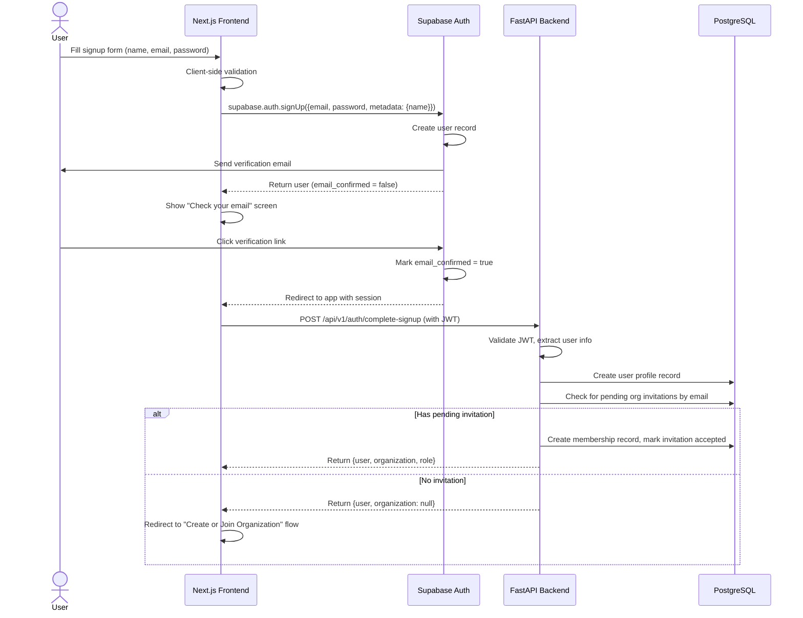
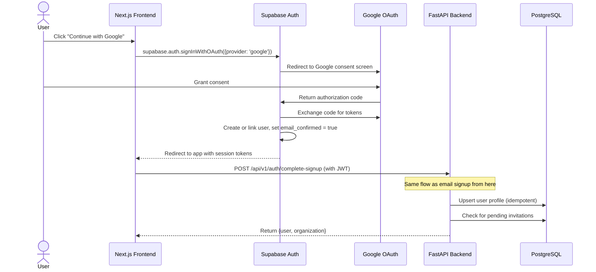
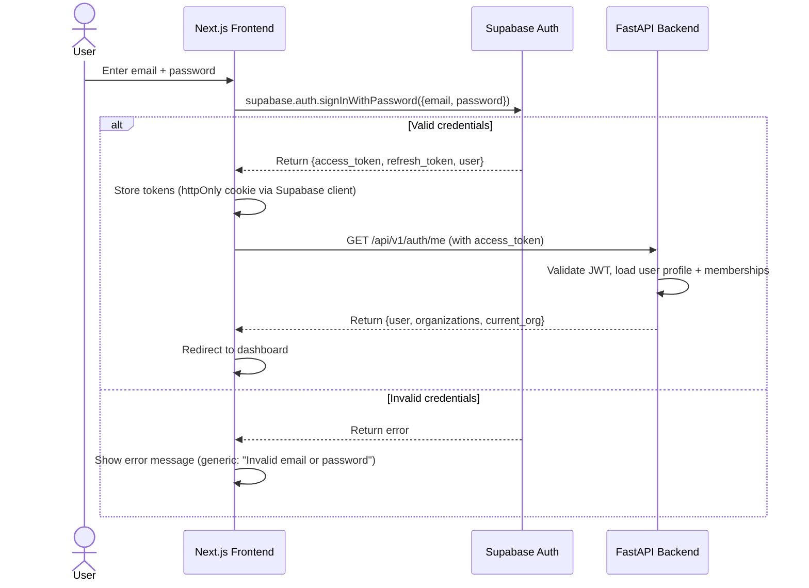
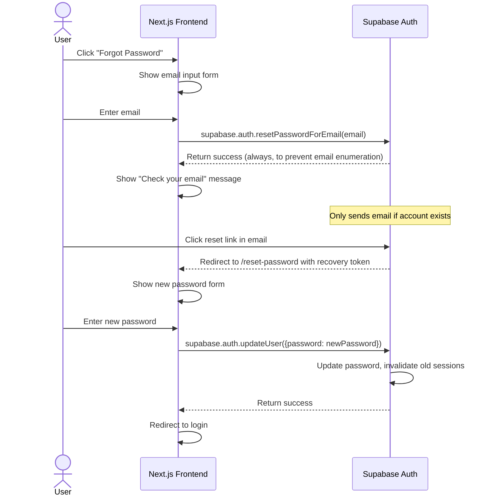

# Security & Authentication Model

**Version:** 1.0
**Status:** Approved
**Last Updated:** 2026-06-30
**Owner:** Architecture Team
**Related Documents:**
- [RBAC](../system/rbac.md)

---

## 4.1 Authentication Strategy

Calyx delegates identity management to **Supabase Auth**. This gives us:

- Battle-tested JWT issuance and validation
- Built-in email verification and password reset flows
- Google OAuth support out of the box
- Refresh token rotation
- Session management

Our application layer adds:

- Organization context resolution (which org is the user operating in?)
- Custom JWT claims for RBAC (role, org_id)
- Membership validation

## 4.2 Email Signup Flow

## 4.3 Google OAuth Flow

## 4.4 Login Flow

## 4.5 Session Lifecycle

| Event | Behavior |
|---|---|
| **Login** | Supabase issues an access token (JWT, ~1 hour TTL) and a refresh token (~30 days TTL, rotated on use). |
| **Authenticated request** | Frontend attaches access token as `Authorization: Bearer <token>`. Backend validates signature, expiry, and claims. |
| **Token expiry** | Supabase client SDK automatically uses the refresh token to obtain a new access token. This is transparent to the user. |
| **Refresh token rotation** | Each time a refresh token is used, Supabase issues a new one and invalidates the old one. This limits the window of a stolen refresh token. |
| **Logout** | Frontend calls `supabase.auth.signOut()`. Supabase invalidates the refresh token. Frontend clears local state. |
| **Forced logout** | Org Admin deactivates a user → backend revokes their sessions via Supabase Admin API → user is forced to re-authenticate on next request. |
| **Inactivity timeout** | Handled by access token expiry. If the user is inactive beyond the refresh token lifetime, they must re-authenticate. |

## 4.6 Password Reset Flow

## 4.7 Email Verification

- **On signup:** Supabase sends a verification email automatically. The user cannot access protected routes until email is verified.
- **Resend:** The frontend provides a "Resend verification email" action, which calls `supabase.auth.resend()`.
- **Enforcement:** The backend middleware checks the `email_confirmed` claim in the JWT. Unverified users receive a `403 Forbidden` with a clear message.
- **Google OAuth:** Email is automatically verified (Google has already verified it).

---
